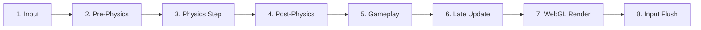

# AGENTS.md — AI Agent Guidelines & Engineering Contract

> **Project:** ScopeCreep (3D Cooperative Naval & Aviation Combat Game)  
> **Target Environment:** Modern Web Browsers (WebGL, WebAssembly, WebSockets)  
> **Core Stack:** Three.js, Rapier 3D (WASM), Vite, GLSL Shaders, PartyKit  
> **Architecture Reference:** Consult [ARCHITECTURE_AND_SYSTEMS.md](./ARCHITECTURE_AND_SYSTEMS.md) for detailed subsystem architecture, procedural geometry builders, and shader models.

---

## 1. Core Principles & Priority Hierarchy

Guidelines follow RFC 2119 priority levels:

### MUST (Hard Invariants)
- **Respect lifecycle phases:** Moving platforms update in Phase 2 (`prePhysicsUpdate`), kinematic character sweeps run in Phase 4 (`postPhysicsUpdate`), weapon/AI logic updates in Phase 5 (`gameplayUpdate`), cameras position in Phase 6 (`lateUpdate`).
- **Never send engine objects over the network:** PartyKit edge payloads must consist strictly of plain numeric Data Transfer Objects (primitives, booleans); never serialize Three.js scene graphs or Rapier physics objects.
- **Dispose GPU & physics resources:** Geometries, materials, textures, and Rapier colliders must be cleanly released in `dispose()` to prevent WebGL memory leaks.
- **Use semantic inputs:** Always query inputs through `InputManager` action bindings (`isActionDown`, `isActionJustPressed`), never raw key strings in entity code.
- **Build must pass:** Before considering a task complete, run `npm run build`. Do not consider the change complete if the production build fails.

### SHOULD (Strong Engineering Practices)
- **Avoid allocations in hot loops:** Preallocate math scratchpads (`THREE.Vector3`, `THREE.Quaternion`, `THREE.Matrix4`); do not instantiate temporary objects in per-frame updates.
- **Reuse existing abstractions:** Check existing components before creating new ones; do not invent convenience wrappers when established APIs exist.
- **Pool high-frequency actors:** Projectiles, flak rounds, shells, and short-lived particles should use an object pool rather than continuous dynamic runtime allocation.
- **Prefer compound cuboids:** Prefer compound cuboid colliders for ship/deck walking surfaces rather than dynamic trimeshes. Use approximately $3.5\text{m}$ deep slabs where appropriate to provide sufficient collision depth for expected platform motion and prevent tunneling.
- **Validate in sandbox:** Validate and calibrate new mechanics, weapons, and character controls in `TestLevel` before wiring them into operational mission stages like `Level01`.
- **Keep components simple:** Build lightweight, single-purpose components (e.g. `HealthComponent` managing only health and kinetic/explosive damage without premature multi-zone complexity).
- **Synchronize CPU/GPU wave math:** Any changes to wave displacement formulas in `ocean.vert.glsl` should be accurately mirrored in `Ocean.getWaveHeight()`.
- **Externalize balance to `config.json`:** Gameplay balance parameters (projectile velocities, damage, drag, player speeds, ship propulsion metrics) should be defined in `src/config.json` rather than hardcoded in entity logic. Do not put shader or rendering values in `config.json`; keep visual parameters self-contained within rendering classes.

### MAY (Discretionary)
- Non-essential performance micro-optimizations not required by profiling.
- Experimental dev tools, wireframes, or inspection helpers in test levels.

---

## 2. Before Making Changes

Before modifying code:

1. **Inspect the existing implementation** of the relevant system.
2. **Identify which lifecycle phase** owns the behavior.
3. **Check existing classes and components** for reusable functionality.
4. **Do not create a new abstraction** if an existing one already handles the responsibility.
5. **Preserve existing public APIs** unless the task explicitly requires changing them.
6. **Make the smallest change** that satisfies the requirement.
7. **Run relevant verification** during development and `npm run build` before considering the task complete.

### Existing API Integrity

Do not assume methods, properties, files, or systems exist.

Before using an API:
- Inspect its implementation or existing usages in the codebase.
- Follow the project's established naming and lifecycle conventions.
- Do not invent convenience methods when equivalent functionality already exists.

If a required API does not exist, implement it in the appropriate owning class rather than bypassing the architecture.

### Documentation Integrity

- Keep `AGENTS.md` and `ARCHITECTURE_AND_SYSTEMS.md` consistent with implemented behavior.
- Do not modify architecture documentation merely to justify a code change.
- Update documentation when the actual architecture or public behavior changes.

---

## 3. Ownership Rules

- **`GameWorld`** owns global engine systems, canvas, WebGL renderer, root scene graph hierarchy, master clock, and the 8-phase frame pipeline.
- **`PhysicsWorld`** owns Rapier WASM world state, rigid bodies, colliders, character controllers, and debug rendering.
- **Entities (`BaseEntity`)** own their visual representation (`this.mesh`), physical colliders, and lifecycle hooks.
- **Levels (`BaseLevel`)** own level-specific entities, lighting, environment actors, and stage-level tools.
- **`BaseLevel`** owns disposal tracking for level resources via `this.trackDisposable(resource)`.
- **Object Pools** own pooled instances (e.g. projectiles) and manage their active/inactive lifecycle.
- **Components** must not independently register themselves with `GameWorld` unless explicitly designed to do so.

---

## 4. The 8-Phase Lifecycle Contract

In a moving-platform simulation, unphased single-loop `update(delta)` calls cause 1-frame kinematic lag (characters hovering or clipping through moving decks), tunneling, and camera jitter.

`GameWorld._loop()` executes an explicit 8-phase pipeline every frame:



| Phase | Hook / Function | Purpose | Ownership / Examples |
| :--- | :--- | :--- | :--- |
| **Phase 1** | Input Check | Global key bindings, hotkeys | `InputManager` |
| **Phase 2** | `prePhysicsUpdate(delta, gameWorld)` | Moving platforms, buoyant vessels, water sampling | `Battleship.prePhysicsUpdate`, `ShipBuoyancy` |
| **Phase 3** | `physics.step(delta)` | Rapier WASM simulation step | `PhysicsWorld.step` |
| **Phase 4** | `postPhysicsUpdate(delta, gameWorld)` | Kinematic character sweeps, platform delta inheritance | `Player.postPhysicsUpdate` |
| **Phase 5** | `gameplayUpdate(delta, gameWorld)` | Weapons, ballistics, AI state machines, timers | `ArtilleryTurret`, `FlakTurret`, `BaseStation` |
| **Phase 6** | `lateUpdate(delta, gameWorld)` | Camera positioning, spring-arm raycasts, reticles | `SpringArmCamera`, `Player.lateUpdate` |
| **Phase 7** | `renderer.render()` | Three.js WebGL scene draw call | `GameWorld`, `FPSTracker` |
| **Phase 8** | `input.update()` | Single-frame transition clearance | `InputManager.update` |

### Golden Phase Rules
- **Platforms in Phase 2:** Moving platforms and buoyant hulls must update transforms in `prePhysicsUpdate` before Rapier steps.
- **Characters in Phase 4:** Walking avatars must sweep in `postPhysicsUpdate` after platforms have moved, sampling platform deltas.
- **Cameras in Phase 6:** Follow cameras must position in `lateUpdate` after all actors have settled to prevent visual stutter.
- **Input state:** Phase 1 reads and exposes the current input state; Phase 8 clears transient states such as `justPressed` and `mouseDelta`. Entity code must not manually clear input transitions.

---

## 5. Coding Standards & Conventions

### 1. Module System & File Extensions
- Use standard ES Modules (`import` / `export`).
- Always specify explicit file extensions in imports:
  ```javascript
  import { Player } from './Player.js';
  ```
- Do not import external npm packages without confirming they exist in `package.json`.

### 2. Semantic Input Handling
- Always check inputs via `InputManager` semantic actions rather than raw key strings:
  ```javascript
  // Good:
  if (this.gameWorld.input.isActionDown('forward')) { ... }
  if (this.gameWorld.input.isActionJustPressed('specialAction')) { ... }

  // Avoid:
  if (keys['KeyW']) { ... }
  ```
- If a new control action is needed, register it in `actionBindings` in `src/core/InputManager.js`.

### 3. Resource Disposal
- Any entity or level that creates geometries, materials, or textures must dispose them cleanly:
  ```javascript
  dispose() {
    if (this.mesh) {
      this.mesh.traverse((child) => {
        if (child.geometry) child.geometry.dispose();
        if (child.material) {
          if (Array.isArray(child.material)) child.material.forEach(m => m.dispose());
          else child.material.dispose();
        }
      });
    }
    super.dispose();
  }
  ```

### 4. Gameplay Configuration (`config.json`)
- Define gameplay balance parameters (weapon damage, projectile speeds, cadences, player speeds, ship propulsion) in `src/config.json`.
- Do not hardcode "magic numbers" for gameplay tuning inside entity classes. Always provide fallback to `config.json` while honoring explicit `options` overrides.
- Do not include rendering, visual, or shader parameters (such as Gerstner wave vectors or material colors) in `config.json`; rendering configuration belongs inside the corresponding rendering modules (e.g. `Ocean.js`).
  ```javascript
  // Good:
  import config from '../config.json';
  const speed = options.speed !== undefined ? options.speed : config.projectiles.artillery.speed;

  // Avoid:
  const speed = options.speed || 220.0; // Hardcoded magic number
  ```

---

## 6. Essential Commands & Verification

```bash
# Start local development server (HMR enabled)
npm run dev

# Build production bundle (MANDATORY verification step)
npm run build
```

> **Note on Verification:** Always run `npm run build` after making changes to verify that Vite bundle transformations (GLSL shaders, WebAssembly, top-level await) compile with zero errors.
