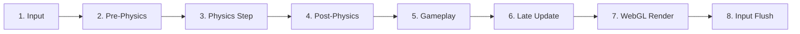

# AGENTS.md — AI Agent Guidelines & Engineering Contract

> **Project:** ScopeCreep (3D Cooperative Naval & Aviation Combat Game)  
> **Target Environment:** Modern Web Browsers (WebGL, WebAssembly, WebSockets)  
> **Core Stack:** Three.js, Rapier 3D (WASM), Vite, GLSL Shaders, PartyKit  
> **Architecture Reference:** Consult [ARCHITECTURE_AND_SYSTEMS.md](./ARCHITECTURE_AND_SYSTEMS.md) for detailed subsystem architecture, procedural geometry builders, and shader models.

---

## 1. Core Principles & Priority Hierarchy

Guidelines follow RFC 2119 priority levels:

### MUST (Hard Invariants)
- **Respect the 8-phase lifecycle contract:** Moving platforms update in Phase 2 (`prePhysicsUpdate`), kinematic character sweeps run in Phase 4 (`postPhysicsUpdate`), weapon/AI/station logic updates in Phase 5 (`gameplayUpdate`), cameras position in Phase 6 (`lateUpdate`). Sub-components and child systems mounted or owned by an entity must hook into or be explicitly called during their designated lifecycle phase.
- **Never write inline HTML or CSS:** Never call `document.createElement`, `document.body.appendChild`, `style.cssText`, or `.style.*` in entities, components, levels, or core engine code. All UI overlays must use the established `src/ui/` subsystem (`gameWorld.ui` / `UIManager`) and dedicated UI components styled exclusively via `src/ui/ui.css`.
- **Never access Rapier WASM directly in entities or levels:** Do not import `@dimforge/rapier3d-compat` directly in gameplay entities. All physics bodies, colliders, character controllers, raycasts, and collision sweeps must be routed through `PhysicsWorld` (or helper adapters like `ThreePhysicsAdapter` / `BattleshipColliders`).
- **Use semantic inputs from `InputManager`:** Always query inputs through `InputManager` semantic action bindings (`isActionDown`, `isActionJustPressed`, `getAxis`). Never use raw key strings (`KeyW`, `Space`, `KeyE`) or manual event listeners in entity/level code. If an action does not exist yet, **add it to `actionBindings` in `src/core/InputManager.js`** first.
- **Externalize gameplay balance to `config.json`:** All gameplay balance and tuning values (movement speeds, accelerations, jump force, turn rates, weapon damage, cadences, cooldowns, projectile velocities, gravity, drag, health pools, turret pitch/yaw limits) must be defined in `src/config.json`. Entities and components must never hardcode magic numbers for balance; always resolve defaults from `config.json` (allowing explicit `options` overrides). Visual, shader, and rendering parameters must not be in `config.json`; keep visual configuration self-contained within rendering modules.
- **Never send engine objects over the network:** PartyKit edge payloads must consist strictly of plain numeric Data Transfer Objects (primitives, booleans); never serialize Three.js scene graphs or Rapier physics objects.
- **Dispose GPU, physics, and UI resources:** Geometries, materials, textures, Rapier colliders, and UI subscriptions/elements must be cleanly released in `dispose()` to prevent memory leaks.
- **Build must pass:** Before considering a task complete, run `npm run build`. Do not consider the change complete if the production bundle build fails.
- **Tests must pass:** Run `npm test` before committing. A change that breaks an existing test is not complete; fix the code or, if the behaviour change is intended, update the test in the same commit. New gameplay systems come with tests in `tests/` (see `tests/README.md`).

### SHOULD (Strong Engineering Practices)
- **Avoid allocations in hot loops:** Preallocate math scratchpads (`THREE.Vector3`, `THREE.Quaternion`, `THREE.Matrix4`); do not instantiate temporary objects in per-frame updates.
- **Reuse existing abstractions:** Check existing components before creating new ones; do not invent convenience wrappers when established APIs exist.
- **Pool high-frequency actors:** Projectiles, flak rounds, shells, and short-lived particles should use an object pool rather than continuous dynamic runtime allocation.
- **Prefer compound cuboids:** Prefer compound cuboid colliders for ship/deck walking surfaces rather than dynamic trimeshes. Use approximately $3.5\text{m}$ deep slabs where appropriate to provide sufficient collision depth for expected platform motion and prevent tunneling.
- **Validate in sandbox:** Validate and calibrate new mechanics, weapons, and character controls in `TestLevel` before wiring them into operational mission stages like `Level01`.
- **Keep components simple:** Build lightweight, single-purpose components (e.g. `HealthComponent` managing only health and kinetic/explosive damage without premature multi-zone complexity).
- **Synchronize CPU/GPU wave math:** Any changes to wave displacement formulas in `ocean.vert.glsl` should be accurately mirrored in `Ocean.getWaveHeight()`.

### MAY (Discretionary)
- Non-essential performance micro-optimizations not required by profiling.
- Experimental dev tools, wireframes, or inspection helpers in test levels.

---

## 2. Before Making Changes

Before modifying code:

1. **Inspect the existing implementation** of the relevant system.
2. **Identify which lifecycle phase** owns the behavior.
3. **Check existing classes and components** for reusable functionality.
4. **Do not create a new abstraction** if an existing one already handles the responsibility.
5. **Preserve existing public APIs** unless the task explicitly requires changing them.
6. **Make the smallest change** that satisfies the requirement.
7. **Run relevant verification** during development and `npm run build` before considering the task complete.

### Existing API Integrity

Do not assume methods, properties, files, or systems exist.

Before using an API:
- Inspect its implementation or existing usages in the codebase.
- Follow the project's established naming and lifecycle conventions.
- Do not invent convenience methods when equivalent functionality already exists.

If a required API does not exist, implement it in the appropriate owning class rather than bypassing the architecture.

### Documentation Integrity

- Keep `AGENTS.md` and `ARCHITECTURE_AND_SYSTEMS.md` consistent with implemented behavior.
- Do not modify architecture documentation merely to justify a code change.
- Update documentation when the actual architecture or public behavior changes.

---

## 3. Ownership Rules

- **`GameWorld`** owns global engine systems, canvas, WebGL renderer, root scene graph hierarchy, master clock, `UIManager` (`this.ui`), and the 8-phase frame pipeline.
- **`UIManager` (`src/ui/UIManager.js`)** owns all HUD overlays, interaction prompts, station telemetry HUDs, crosshairs, health bars, toast notifications, FPS display, controls helpers, and dev tool panels.
- **`PhysicsWorld`** owns Rapier WASM world state, rigid bodies, colliders, character controllers, and debug rendering. Entities interact with physics strictly through `PhysicsWorld` or designated adapters.
- **Entities (`BaseEntity`)** own their visual representation (`this.mesh`), physical colliders, sub-components, and lifecycle hooks.
- **Levels (`BaseLevel`)** own level-specific entities, lighting, environment actors, and stage-level tools.
- **`BaseLevel`** owns disposal tracking for level resources via `this.trackDisposable(resource)`.
- **Object Pools** own pooled instances (e.g. projectiles) and manage their active/inactive lifecycle.
- **Components** must not independently register themselves with `GameWorld` unless explicitly designed to do so.

---

## 4. The 8-Phase Lifecycle Contract

In a moving-platform simulation, unphased single-loop `update(delta)` calls cause 1-frame kinematic lag (characters hovering or clipping through moving decks), tunneling, and camera jitter.

`GameWorld._loop()` executes an explicit 8-phase pipeline every frame:


```mermaid
flowchart LR
    P1[1. Input] --> P2[2. Pre-Physics]
    P2 --> P3[3. Physics Step]
    P3 --> P4[4. Post-Physics]
    P4 --> P5[5. Gameplay]
    P5 --> P6[6. Late Update]
    P6 --> P7[7. WebGL Render]
    P7 --> P8[8. Input Flush]
```

| Phase | Hook / Function | Purpose | Ownership / Examples |
| :--- | :--- | :--- | :--- |
| **Phase 1** | Input Check | Global key bindings, hotkeys | `InputManager` |
| **Phase 2** | `prePhysicsUpdate(delta, gameWorld)` | Moving platforms, buoyant vessels, water sampling, syncing colliders before step | `Battleship.prePhysicsUpdate`, `ShipBuoyancy` |
| **Phase 3** | `physics.step(delta)` | Rapier WASM simulation step | `PhysicsWorld.step` |
| **Phase 4** | `postPhysicsUpdate(delta, gameWorld)` | Kinematic character sweeps, platform delta inheritance | `Player.postPhysicsUpdate` |
| **Phase 5** | `gameplayUpdate(delta, gameWorld)` | Weapons, turret traverse, firing, ballistics, AI, health | `ArtilleryTurret`, `FlakTurret`, `BaseStation` |
| **Phase 6** | `lateUpdate(delta, gameWorld)` | Camera positioning, spring-arm raycasts, reticles | `SpringArmCamera`, `Player.lateUpdate`, station cameras |
| **Phase 7** | `renderer.render()` | Three.js WebGL scene draw call | `GameWorld`, `FPSTracker` |
| **Phase 8** | `input.update()` | Single-frame transition clearance | `InputManager.update` |

### Golden Phase Rules
- **Platforms in Phase 2:** Moving platforms and buoyant hulls must update transforms and sync colliders in `prePhysicsUpdate` before Rapier steps.
- **Characters in Phase 4:** Walking avatars must sweep in `postPhysicsUpdate` after platforms have moved, sampling platform deltas.
- **Weapons and Gameplay in Phase 5:** Turret rotation, barrel elevation, firing cadences, projectile flight, and health updates belong in `gameplayUpdate`.
- **Cameras in Phase 6:** Follow cameras and station cameras must position in `lateUpdate` after all actors have settled to prevent visual stutter.
- **Sub-Entities Follow Their Parent:** When creating a composite entity (like `Battleship`), delegate update calls to sub-components during the exact phase those sub-components belong to:
  ```javascript
  // Inside Battleship.js:
  prePhysicsUpdate(delta, gameWorld) {
    this.buoyancy.update(delta);               // Phase 2: Buoyancy physics
    this.shipController.update(delta);         // Phase 2: Hull movement & rudder
    this.colliders.syncGunColliders();         // Phase 2: Sync Rapier colliders
  }

  gameplayUpdate(delta, gameWorld) {
    this.mainGun.update(delta, gameWorld);      // Phase 5: Turret aiming & firing
    this.flakTurret.update(delta, gameWorld);   // Phase 5: Anti-air flak logic
  }

  lateUpdate(delta, gameWorld) {
    this.shipController.lateUpdate(delta, gameWorld); // Phase 6: Helm chase camera
  }
  ```
- **Input state:** Phase 1 reads and exposes the current input state; Phase 8 clears transient states such as `justPressed` and `mouseDelta`. Entity code must not manually clear input transitions.

---

## 5. Coding Standards & Conventions

### 1. UI Architecture & Zero Inline HTML/CSS Rule
All HUD elements, floating text, prompts, health meters, and telemetry panels must use the established `UIManager` subsystem in `src/ui/`.
- **NEVER** write inline DOM creation or inline CSS in entities, components, or levels:
  ```javascript
  // FORBIDDEN:
  const el = document.createElement('div');
  el.style.cssText = 'position:fixed; color:red;';
  document.body.appendChild(el);
  ```
- **ALWAYS** access the UI system via `gameWorld.ui`:
  ```javascript
  // ALLOWED & REQUIRED:
  gameWorld.ui.showPrompt('[E]', 'MAN ARTILLERY TURRET', '#4488ff', this);
  gameWorld.ui.hidePrompt(this);
  ```
- **UI Architecture Structure:**
  - `src/ui/UIManager.js`: Central coordinator attached to `gameWorld.ui`.
  - `src/ui/components/`: Modular component classes (`InteractionPrompt`, `StationHUD`, `Crosshair`, `HealthBar`, `ToastNotification`, `FPSDisplay`, `ControlsHelper`, `DevToolsWidget`, `MainMenu`, `PauseMenu`, `PauseButton`, plus Level 2's `StatusIndicator`, `WeaponHUD`, `PlayerHealthBar`, `DamageFlash`, `ObjectivePanel`, `MissionResult`, `CinematicOverlay`).
  - A level lists the controls its controls card shows by overriding `get controls()` on `BaseLevel` (action names, not key strings: keys come from `InputManager` bindings).
  - `src/ui/ui.css`: Consolidated stylesheet for all UI components.

#### Concrete UI Examples from Battleship & Ship Components:
- **`Battleship.js` (Health Bar):**
  ```javascript
  // Updating health in gameplayUpdate:
  if (this.gameWorld && this.gameWorld.ui) {
    this.gameWorld.ui.updateHealthBar(this.health.currentHealth, this.health.maxHealth);
  }

  // Cleanup in dispose():
  if (this.gameWorld && this.gameWorld.ui) {
    this.gameWorld.ui.hideHealthBar();
  }
  ```
- **`BaseStation.js` (Proximity Prompts, Station HUDs & Crosshairs):**
  ```javascript
  // On player entering proximity:
  gameWorld.ui.showPrompt('[E]', `OPERATE ${this.stationName.toUpperCase()}`, this.promptColor, this);

  // On player leaving proximity:
  gameWorld.ui.hidePrompt(this);

  // When player mounts station:
  gameWorld.ui.hidePrompt(this);
  gameWorld.ui.showStationHUD(this.stationType, this.hudConfig);
  gameWorld.ui.showCrosshair(this.crosshairType);

  // When player dismounts station:
  gameWorld.ui.hideStationHUD();
  gameWorld.ui.hideCrosshair();
  ```
- **`HelmStation.js` & `ArtilleryTurret.js` (Telemetry Updates in Phase 5):**
  ```javascript
  // Helm station telemetry HUD:
  gameWorld.ui.updateStationHUD('helm', {
    speedKnots: (forwardSpeed * 1.94384).toFixed(1),
    rudderAngle: (rudder * (180 / Math.PI)).toFixed(0),
    headingDegrees: Math.round(headingDeg)
  });

  // Artillery turret targeting HUD:
  gameWorld.ui.updateStationHUD('artillery', {
    azimuthDeg: (this.currentYaw * 180 / Math.PI).toFixed(1),
    elevationDeg: (this.currentPitch * 180 / Math.PI).toFixed(1),
    ready: this.isReadyToFire()
  });
  ```

#### Level Registration & Menu UI (`AVAILABLE_LEVELS` in `src/main.js`):
When creating a new level stage (subclassing `BaseLevel` in `src/levels/`), register it in `AVAILABLE_LEVELS` inside `src/main.js` so it automatically appears as a selectable mission on the Main Menu screen:
```javascript
// Inside src/main.js:
const AVAILABLE_LEVELS = [
  {
    id: 'level01',
    title: 'Level 1: Operation Retake',
    create: (gw) => new Level01(gw)
  },
  {
    id: 'testlevel',
    title: 'Sandbox: Flat Ground',
    create: (gw) => new TestLevel(gw)
  },
  {
    id: 'level02',
    title: 'Level 2: Pacific Strike',
    create: (gw) => new Level02(gw)
  }
];
```
- **UI Lifecycle Contract:** `gameWorld.loadLevel(instance)` initializes the stage and automatically shows the in-game HUD (`[Options]` pause button, controls helper, and warship health bar).
- **Return to Menu:** `gameWorld.returnToMainMenu()` cleanly calls `currentLevel.dispose()`, resets all in-game HUDs via `gameWorld.ui.resetLevelHUD()`, and restores the Main Menu selector.

---

### 2. Physics Abstraction (`PhysicsWorld`)
Entities and levels must never import or interface directly with Rapier WASM (`@dimforge/rapier3d-compat`). Direct access breaks encapsulation, leaks native WASM resources, and bypasses collision group filtering.
- **ALWAYS** route physics through `gameWorld.physics` (`PhysicsWorld`) or engine adapters (`ThreePhysicsAdapter`, `BattleshipColliders`):
  ```javascript
  // Good:
  const rigidBody = gameWorld.physics.createRigidBody({ ... });
  const collider = gameWorld.physics.createCollider(desc, rigidBody);
  const controller = gameWorld.physics.createCharacterController({ offset: 0.05 });
  ```
  ```javascript
  // FORBIDDEN:
  import RAPIER from '@dimforge/rapier3d-compat';
  const world = new RAPIER.World(...); // Violates engine encapsulation
  ```

---

### 3. Semantic Input Handling (`InputManager`)
- Always query inputs via `InputManager` semantic actions rather than raw key strings:
  ```javascript
  // Good:
  if (this.gameWorld.input.isActionDown('forward')) { ... }
  if (this.gameWorld.input.isActionJustPressed('specialAction')) { ... }
  const steer = this.gameWorld.input.getAxis('steerLeft', 'steerRight');

  // FORBIDDEN:
  if (keys['KeyW']) { ... }
  if (e.code === 'KeyE') { ... }
  ```
- **Adding New Input Actions:** If a feature requires a key binding that does not exist yet, **add it to `actionBindings` in `src/core/InputManager.js`** before using it in entity code:
  ```javascript
  // Inside src/core/InputManager.js:
  this.actionBindings = {
    // ... existing actions
    fireSecondary: ['Mouse2', 'KeyR'],
    dismount: ['KeyQ', 'Escape'],
  };
  ```

---

### 4. Module System & File Extensions
- Use standard ES Modules (`import` / `export`).
- Always specify explicit file extensions in imports:
  ```javascript
  import { Player } from './Player.js';
  ```
- Do not import external npm packages without confirming they exist in `package.json`.

---

### 5. Resource Disposal
- Any entity, level, or UI element that creates geometries, materials, textures, colliders, or DOM event listeners must dispose them cleanly:
  ```javascript
  dispose() {
    if (this.mesh) {
      this.mesh.traverse((child) => {
        if (child.geometry) child.geometry.dispose();
        if (child.material) {
          if (Array.isArray(child.material)) child.material.forEach(m => m.dispose());
          else child.material.dispose();
        }
      });
    }
    if (this.collider && this.physicsWorld) {
      this.physicsWorld.removeCollider(this.collider);
    }
    super.dispose();
  }
  ```

---

### 6. Gameplay Configuration (`config.json`)
- Define gameplay balance parameters (weapon damage, projectile speeds, cadences, player speeds, ship propulsion) in `src/config.json`.
- Do not hardcode "magic numbers" for gameplay tuning inside entity classes. Always provide fallback to `config.json` while honoring explicit `options` overrides.
- Do not include rendering, visual, or shader parameters (such as Gerstner wave vectors or material colors) in `config.json`; rendering configuration belongs inside the corresponding rendering modules (e.g. `Ocean.js`).
  ```javascript
  // Good:
  import config from '../config.json';
  const speed = options.speed !== undefined ? options.speed : config.projectiles.artillery.speed;

  // Avoid:
  const speed = options.speed || 220.0; // Hardcoded magic number
  ```

---

## 6. Essential Commands & Verification

```bash
# Start local development server (HMR enabled)
npm run dev

# Build production bundle (MANDATORY verification step)
npm run build

# Run the regression tests (MANDATORY before committing)
npm test
```

> **Note on Verification:** Always run `npm run build` after making changes to verify that Vite bundle transformations (GLSL shaders, WebAssembly, top-level await) compile with zero errors.

