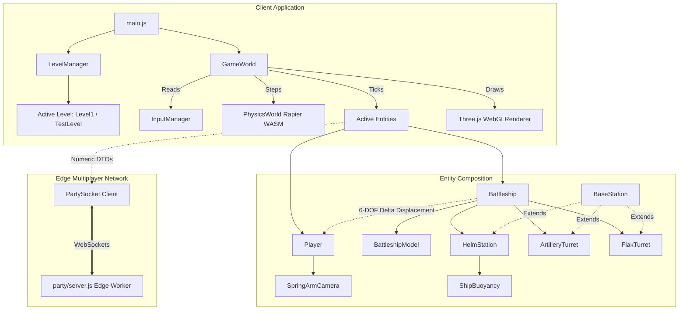
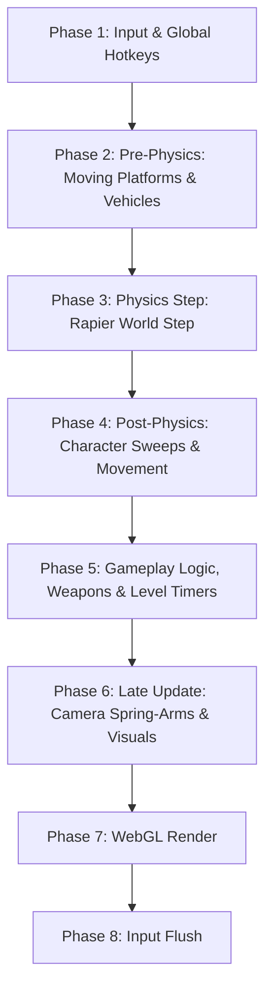

# ScopeCreep: Systems & Architecture Documentation

> **Project:** ScopeCreep (3D Cooperative Naval & Aviation Combat Game)  
> **Course:** Computer Graphics & Visualization (CGV)  
> **Core Technologies:** Three.js (WebGL), Rapier 3D (WebAssembly Physics), Vite, Custom GLSL Shaders, PartyKit (Edge WebSockets), Yuka (Game AI).

---

## Table of Contents
1. [Project Overview](#1-project-overview)
2. [Architecture](#2-architecture)
   - [2.1 High-Level Architecture](#21-high-level-architecture)
   - [2.2 Core Systems](#22-core-systems)
   - [2.3 Entity Architecture](#23-entity-architecture)
   - [2.4 Level Architecture](#24-level-architecture)
   - [2.5 Rendering Architecture](#25-rendering-architecture)
   - [2.6 Physics Architecture](#26-physics-architecture)
   - [2.7 Networking Architecture](#27-networking-architecture)
3. [Execution Flow](#3-execution-flow)
   - [3.1 Startup & Bootstrapping](#31-startup--bootstrapping)
   - [3.2 Level Loading & Teardown](#32-level-loading--teardown)
   - [3.3 Frame Update: The 8-Phase Pipeline](#33-frame-update-the-8-phase-pipeline)
   - [3.4 Rendering & Camera Selection](#34-rendering--camera-selection)
4. [Repository Structure](#4-repository-structure)
5. [Component Reference](#5-component-reference)
6. [Development Workflows](#6-development-workflows)
   - [Creating a New Level](#creating-a-new-level)
   - [Debugging Physics & Colliders](#debugging-physics--colliders)
   - [Switching Between Levels](#switching-between-levels)
7. [Open Considerations & Gotchas (To Figure Out As We Go)](#7-open-considerations--gotchas-to-figure-out-as-we-go)
   - [Networking & Replication](#networking--replication)
   - [Entity Phase Contract](#entity-phase-contract)
   - [Projectiles & Object Pooling](#projectiles--object-pooling)
   - [Damage State Placement](#damage-state-placement)
   - [Enemy AI](#enemy-ai)

---

## 1. Project Overview

ScopeCreep is a 3D real-time naval and aerial combat simulation built natively for the web browser. Players navigate an open ocean environment aboard a guided-missile destroyer, operating stations (helm steering, forward twin heavy artillery, aft quad anti-aircraft flak) or moving on foot across the pitching and rolling decks of the vessel.

### Fundamental Graphics vs. Physics Concepts

A foundational principle of this project is the strict decoupling of **Visual Representation** from **Physical Simulation**:

| Concept | Subsystem | Purpose | Representation in Code |
| :--- | :--- | :--- | :--- |
| **Mesh** | Graphics (Three.js) | Visual 3D geometry rendered to screen. Consists of vertices, faces, and normals. | `THREE.Mesh(geometry, material)` (e.g. detailed hull, antennas, railings). |
| **Collider** | Physics (Rapier 3D) | Invisible mathematical boundary used for collision sweeps, penetration resolution, and contacts. | `RAPIER.ColliderDesc.cuboid(...)` or `capsule(...)` attached to rigid bodies. |
| **Material** | Graphics (Three.js) | Surface optical properties (color, roughness, metalness, transparency, light reflectance). | `THREE.MeshStandardMaterial` or custom `THREE.ShaderMaterial`. |
| **Shader** | GPU (GLSL) | Micro-programs executed per-vertex and per-pixel directly on the graphics card. | `ocean.vert.glsl` (Gerstner waves) and `ocean.frag.glsl` (Fresnel reflection/foam). |

#### Why Colliders Differ from Meshes in ScopeCreep:
1. **Performance:** Visual meshes have thousands of polygons for cosmetic details. Passing visual meshes to physics would degrade framerates. ScopeCreep uses simplified **Compound Cuboid Colliders**.
2. **Tunneling Prevention:** Visual walking decks are thin planes ($0.05\text{m}$). Fast-moving characters can tunnel through thin planes. The physics colliders in ScopeCreep are solid **$3.5\text{m}$ deep slabs**, making tunneling physically impossible.
3. **Kinematic Timing:** Visual meshes move via animation clocks. Physical colliders must be transformed explicitly *before* collision sweeps run so characters sweep against current positions.

---

## 2. Architecture

### 2.1 High-Level Architecture

The game follows a decoupled coordinator architecture. A central `GameWorld` owns the canvas, WebGL renderer, root scene, clock, and physics engine. Game stages are managed by `LevelManager`, while domain-specific actors live as modular `Entities`.



---

### 2.2 Core Systems

The engine infrastructure is stage-agnostic and located in `src/core/`:
- **`GameWorld`:** Master engine coordinator. Owns the animation loop, Three.js scene graph hierarchy (`environmentGroup`, `entitiesGroup`, `projectilesGroup`, `effectsGroup`), master clock, camera selection, and dispatches the execution pipeline.
- **`PhysicsWorld`:** Wrapper for `@dimforge/rapier3d-compat` (WebAssembly). Manages gravity, rigid bodies, colliders, character controllers, and extracts high-contrast debug lines via `debugRender()`.
- **`InputManager`:** Centralized input mapper. Captures raw keyboard and mouse events, manages browser pointer lock for FPS mouselook, and maps keys to semantic action bindings (`forward`, `jump`, `toggleColliders`). Clears single-frame transitions at the end of every frame.
- **`LevelManager`:** Handles level lifecycle. Responsible for loading new stages, tearing down previous stage assets from GPU memory, and delegating frame updates.

---

### 2.3 Entity Architecture & The Phase Contract

Entities are self-contained game actors with optional 3D meshes, physical colliders, and lifecycle update hooks.
- **Hierarchical Composition:** The `Battleship` acts as a composite vessel entity:
  - Procedural 3D CAD mesh construction is delegated to **`BattleshipModel`** (`src/entities/models/BattleshipModel.js`).
  - Wave height multi-probe sampling and inertial pitch/roll/heave damping are delegated to **`ShipBuoyancy`** (`src/entities/ship-components/ShipBuoyancy.js`).
  - Operational vessel stations (**`HelmStation`**, **`ArtilleryTurret`**, **`FlakTurret`**) inherit from **`BaseStation`** (`src/entities/ship-components/BaseStation.js`).
- **Interactive Stations (`BaseStation`):** Unifies proximity detection fields, deck indicator pulsing, player limbo teleportation (`y = -100`), dedicated station cameras, HUD overlays, and precise relative deck coordinate mapping (`getShipRoot()`) so dismounting safely restores the player to the moving vessel deck.
- **Spring Arm Camera Subsystem (`SpringArmCamera`):** Decoupled into `src/entities/player-components/SpringArmCamera.js`. Manages Rapier obstacle occlusion raycasts, smooth spring arm compression/expansion, and seamless toggling between First-Person eye view and Third-Person orbit view.
- **Moving Platform Delta Kinematics:** To allow characters to walk naturally on a moving, pitching warship deck without slipping or phasing, `Battleship` calculates its exact 6-DOF world transformation delta between frames (`getPlatformDisplacement`). The `Player` (`CharacterController`) samples this displacement and adds it directly to its kinematic sweep.

#### The Entity Phase Contract (`BaseEntity.js`)
To prevent 1-frame kinematic lag, character tunneling, and camera jitter, entities must not dump all logic into an unordered `update(dt)`. Instead, all dynamic actors inherit from `BaseEntity` and adhere to a strict **phase contract**:

| Entity Category | Concrete Examples | Required Lifecycle Hook | Why It Must Run in This Phase |
| :--- | :--- | :--- | :--- |
| **Kinematic Platforms & Vehicles** | `Battleship`, elevators, cranes, moving docks | **`prePhysicsUpdate(delta, gameWorld)`** | Must compute motion and update Rapier transforms **BEFORE** the physics step so platforms are already in place when characters sweep. |
| **Controlled Characters & Actors** | `CharacterController`, deck crew, foot soldiers | **`postPhysicsUpdate(delta, gameWorld)`** | Must sweep **AFTER** platforms have moved and physics has stepped, inheriting platform deltas to collide with the current frame's surfaces. |
| **Weapons, Projectiles & Ballistics** | `MainGun`, `FlakTurret`, artillery shells, torpedoes | **`gameplayUpdate(delta, gameWorld)`** | Advances trajectories, weapon cooldowns, and collision raycasts against the settled physics state of the current frame. |
| **Cameras & View Tracking** | 1st/3rd person camera, gun sight, spring-arm, crosshairs | **`lateUpdate(delta, gameWorld)`** | Positions camera **AFTER** all actors and platforms have finished moving to prevent visual camera stutter. |
| **Stationary Props / Scenery** | Crates, radar masts, buoys, static obstacles | *None* | Zero update overhead; static colliders never move. |

---

### 2.4 Level Architecture

Levels represent isolated game stages that extend the abstract `BaseLevel` class:
- **`BaseLevel` Contract:** Provides resource tracking (`trackDisposable`) and lifecycle hooks (`init`, `update`, `dispose`). When a level is torn down, all tracked meshes, geometries, materials, lights, and colliders are released from GPU memory.
- **`Level1` (Operational Mission Stage):** Dynamic Gerstner wave ocean surface, atmospheric lighting, battleship combat, ocean safety plane ($Y = -1.0$), void fall recovery ($Y < -15\text{m}$), and developer inspection cameras.
- **`TestLevel` (Ground Sandbox Stage):** Flat static ground plane with coordinate grid, battleship, and standalone artillery stations at $Y = 0$. Designed for fast calibration of weapon traverse and locomotion without wave motion.

---

### 2.5 Rendering Architecture

- **Renderer:** `THREE.WebGLRenderer` configured with antialiasing, high-performance power preference, and soft PCF shadow maps (`PCFSoftShadowMap`).
- **Gerstner Wave Ocean (`WaterMesh`):** Rather than flat geometric planes, the ocean surface is a $2400 \times 2400\text{m}$ subdivided plane ($200 \times 200$ segments) displaced dynamically on the GPU via custom GLSL shaders (`ocean.vert.glsl`).
- **Optical Shading (`ocean.frag.glsl`):** Computes Fresnel reflection equations to blend luminous deep cobalt (`#1a4b6e`) into shallow cyan crests (`#2ca0b8`), applies Blinn-Phong specular sun reflections, overlays procedural foam on wave crests exceeding threshold height, and blends into atmospheric horizon fog.

---

### 2.6 Physics Architecture

- **Rapier 3D WebAssembly:** Compiles deterministic Rust collision pipelines into the browser.
- **Kinematic Character Controller:** Uses Rapier’s specialized character controller with:
  - Auto-stepping over obstacles and curbs up to $0.4\text{m}$ high.
  - Slope climbing angles up to $50^\circ$.
  - Slope sliding for inclines $> 50^\circ$.
  - Downward ground snapping ($0.3\text{m}$) to eliminate hopping when descending stairs/ramps.
- **Compound Cuboids vs. Trimeshes:** Decks and ramps are modeled using compound cuboid boxes rather than raw trimeshes. Cuboid primitives eliminate internal edge "snagging" where characters trip over triangle seams.
- **Anti-Tunneling Slabs:** Decks feature $3.5\text{m}$ deep solid collision volumes, ensuring that even during high-velocity drops or severe wave pitches, characters cannot phase through floors.

---

### 2.7 Networking Architecture (Work in Progress — To Be Figured Out)

Multiplayer edge scaffolding is currently set up with **PartyKit** via WebSockets (`partysocket`), but full replication is an unresolved problem that we will tackle iteratively once single-player systems are stable.

#### Guiding Rule: Keep Visuals Off the Server
The edge server runs headless without DOM, WebGL, GPU, or Three.js. If and when replication is wired up, the server should only exchange minimal numeric payloads, never Three.js scene objects:

```
                 Client Simulation
                         │
        ┌────────────────┴────────────────┐
        ↓                                 ↓
  Visual & Local State              Replication DTO
  (Three.js, Meshes, Cameras,       (Minimal numbers, booleans,
   Shaders, Raycasts, HUD)           no Three.js references)
                                          │
                                          ↓
                                     PartySocket
                                          │
                                          ▼
                                   PartyKit Server
                              (Headless Edge Worker)
```

- **Conceptual DTO Payloads:** Entities would only emit raw simulation numbers:
  ```json
  // MainGun snapshot idea:
  { "id": "gun_fwd", "yaw": 1.248, "pitch": 0.314, "firing": false }

  // Battleship snapshot idea:
  { "id": "ship_alpha", "x": 120.4, "z": -450.8, "heading": 1.57, "rudder": 0.5 }
  ```

#### Known Traps & Open Questions:
1. **Clock Drift on Waves:** Relying on shared `uTime` to recompute wave height locally only holds if clients stay in lockstep. In reality, background browser tabs throttle animation frames, compounding clock drift. Over time, clients will disagree on wave height at the same coordinate. A periodic server time-sync handshake will be needed before this can be trusted.
2. **Turret World-Space Aiming:** If a client's sampled wave pitch/roll drifts even slightly, the physical muzzle position in world space will diverge, complicating hit detection.
3. **Verdict:** We do not have multiplayer replication fully solved. We will prototype it incrementally as we go.

---

## 3. Execution Flow

### 3.1 Startup & Bootstrapping
1. Browser loads `index.html` and executes `src/main.js`.
2. `bootstrap()` instantiates `GameWorld(canvas)` and awaits `gameWorld.init()`.
3. `PhysicsWorld.init()` downloads, compiles, and initializes the Rapier 3D WebAssembly binary.
4. `LevelManager` is instantiated and bound to `GameWorld`.
5. `levelManager.loadLevel()` loads the initial stage (e.g. `Level1` or `TestLevel`).
6. `gameWorld.start()` ignites the 60 FPS animation loop.

---

### 3.2 Level Loading & Teardown
1. `levelManager.loadLevel(newLevel)` is invoked.
2. If a stage is currently active, its `dispose()` method is called:
   - Level-specific colliders (e.g. ocean safety plane or ground plane) are removed from Rapier.
   - Dev tools DOM elements and event listeners are detached.
3. `gameWorld.clearEntities()` and `gameWorld.clearEnvironment()` wipe scene groups and dispose geometries/materials from GPU memory.
4. `newLevel.init()` builds the new stage environment, lights, and entities.

---

### 3.3 Frame Update: The 8-Phase Pipeline

To eliminate 1-frame kinematic lag and resolve moving platform dependencies, `GameWorld._loop()` executes an explicit **8-Phase Pipeline** every frame:



1. **Phase 1: Input & Global Hotkeys:** Checks single-frame inputs (e.g. `[F2]` / `[B]` collider toggle).
2. **Phase 2: Pre-Physics (`prePhysicsUpdate`):** Moving platforms and vehicles (`Battleship`) calculate wave buoyancy, rudder, and update their Three.js transforms. Kinematic rigid bodies are updated in Rapier **before** the physics step.
3. **Phase 3: Physics Step (`physics.step`):** Rapier advances the world simulation with all platforms already at their current frame coordinates; updates debug lines.
4. **Phase 4: Post-Physics (`postPhysicsUpdate`):** Kinematic actors (`CharacterController`) inherit platform deltas, execute collision sweeps against the freshly positioned ship, and update positions with **zero latency**.
5. **Phase 5: Gameplay Logic (`gameplayUpdate` / `update`):** Level timers advance; standalone weapons, projectiles, and unphased entities update.
6. **Phase 6: Late Update (`lateUpdate`):** Follow cameras position themselves, spring-arm collision raycasts prevent camera clipping through walls, and reticles align.
7. **Phase 7: WebGL Render:** `renderer.render(scene, getActiveCamera())` draws the scene.
8. **Phase 8: Input Flush (`input.update`):** Single-frame key transitions (`keysJustPressed`, `mouseDelta`) are cleared.

---

### 3.4 Rendering & Camera Selection
`GameWorld` supports dynamic active cameras. Passing a camera to `gameWorld.setActiveCamera(cam)` seamlessly redirects the rendering pipeline:
- **Player Camera:** Controlled by `CharacterController` (1st person eye level or 3rd person spring-arm orbit).
- **Gun Sight Camera:** Controlled by `MainGun` or `FlakTurret` (aligned along barrel bore with $40^\circ$ optical zoom).
- **Developer Aerial Camera:** Free-orbit inspection camera available in `Level1` dev tools.

---

## 4. Repository Structure

```
ScopeCreep/
├── dist/                   # Production WebGL distribution bundle (Vite build output)
├── party/                  # Serverless WebSocket multiplayer edge worker scripts
│   └── server.js           # PartyKit connection handling & DTO packet routing
├── public/                 # Static public assets (icons, sounds, models)
├── src/
│   ├── core/               # Engine foundation (Stage-agnostic systems)
│   │   ├── GameWorld.js    # Central coordinator: canvas, loop, scene, renderer, clock
│   │   ├── PhysicsWorld.js # Rapier 3D WASM physics wrapper & debug line generator
│   │   ├── InputManager.js # Keyboard, mouse, pointer lock, and semantic action map
│   │   ├── LevelManager.js # Stage transitions, lifecycle, and GPU memory cleanup
│   │   └── FPSTracker.js   # Real-time framerate and frame time HUD performance monitor
│   ├── entities/           # Concrete game actors and interactive objects
│   │   ├── BaseEntity.js   # Abstract lifecycle contract (prePhysics/postPhysics/gameplay/lateUpdate)
│   │   ├── Battleship.js   # Guided-missile destroyer assembly, decks, citadel, colliders
│   │   ├── Player.js       # Human avatar, dual camera, kinematic physics sweep
│   │   ├── components/     # Reusable entity components
│   │   │   └── HealthComponent.js # Basic health tracking (KINETIC and EXPLOSIVE damage)
│   │   ├── models/         # 3D procedural geometry builders
│   │   │   └── BattleshipModel.js # Destroyer hull, superstructure, stairs, collider slabs
│   │   ├── player-components/     # Modular player sub-systems
│   │   │   └── SpringArmCamera.js # 1st/3rd person camera, occlusion raycasting, arm compression
│   │   └── ship-components/# Specialized naval stations and subsystems
│   │       ├── BaseStation.js     # Abstract station lifecycle (mount, dismount, proximity, deck return)
│   │       ├── ShipBuoyancy.js    # 5-probe wave sampling, pitch/roll/heave damping
│   │       ├── HelmStation.js     # Maritime physics, bridge helm, chase camera
│   │       ├── ArtilleryTurret.js # Forward heavy twin naval artillery turret
│   │       └── FlakTurret.js      # Aft anti-air quad rapid-fire flak turret
│   ├── levels/             # Playable environments and stage logic
│   │   ├── BaseLevel.js    # Abstract base class with automated resource disposal
│   │   ├── Level01.js      # Operation Retake: Open ocean combat mission stage
│   │   └── TestLevel.js    # Ground testing sandbox: Flat terrain, isolated weapon testing
│   ├── rendering/          # Visual WebGL components
│   │   ├── Ocean.js        # Subdivided ocean plane driving custom GPU shaders
│   │   └── shaders/        # GPU shader programs (GLSL)
│   │       ├── ocean.vert.glsl # Vertex displacement shader (Gerstner wave math)
│   │       └── ocean.frag.glsl # Fragment shader (Fresnel reflections, foam, depth colors)
│   ├── main.css            # Base stylesheet, reset, HUD typography
│   └── main.js             # Client application bootstrap
├── index.html              # Single-page HTML container with WebGL canvas & UI overlays
├── package.json            # Node.js dependencies, scripts, and build configuration
└── vite.config.js          # Vite plugins (WASM, GLSL) and LAMP server relative base path
```

---

## 5. Component Reference

### `GameWorld` (`src/core/GameWorld.js`)
- `constructor(canvas)`: Initializes Three.js scene, renderer, groups, camera, and input.
- `init()`: Compiles Rapier WASM physics and adds debug line mesh to scene.
- `start()` / `stop()`: Controls the master `requestAnimationFrame` loop.
- `setActiveCamera(camera)`: Switches rendering to a custom camera (`null` restores default).
- `addEntity(entity)` / `removeEntity(entity)`: Manages active entity update roster.
- `clearEntities()` / `clearEnvironment()`: Completely disposes scene groups.
- `toggleColliderDebug()` / `setColliderDebugVisible(bool)`: Toggles physics debug lines.

### `PhysicsWorld` (`src/core/PhysicsWorld.js`)
- `init()`: Compiles `@dimforge/rapier3d-compat` and instantiates `RAPIER.World`.
- `step(delta)`: Advances physics simulation by delta time.
- `createGround(size)`: Creates massive static floor cuboid.
- `createCharacterController(opts)`: Instantiates Rapier kinematic character controller with auto-step and slope limits.
- `createCompoundCuboidsFromObject(obj)`: Generates compound cuboid colliders from mesh bounds.
- `updateDebug()`: Queries Rapier `world.debugRender()` and updates Three.js line buffers with high-contrast neon colors.

### `InputManager` (`src/core/InputManager.js`)
- `requestPointerLock(element)` / `exitPointerLock()`: Manages browser pointer lock.
- `isActionDown(name)`: Checks continuous hold of semantic action.
- `isActionJustPressed(name)` / `isActionJustReleased(name)`: Checks single-frame transitions.
- `getAxis(negAction, posAction)`: Returns float between $-1$ and $+1$.
- `update()`: Flushes single-frame key states at frame end.

### `LevelManager` (`src/core/LevelManager.js`)
- `loadLevel(newLevel)`: Disposes old level and asynchronously boots new stage.
- `restartCurrentLevel()`: Reloads current stage without browser refresh.
- `update(delta)`: Dispatches frame update to active level.

### `FPSTracker` (`src/core/FPSTracker.js`)
- Top-left HUD performance and framerate diagnostic widget (`#fps-tracker`).
- `update()`: Measures frame delta using `performance.now()`, updates rolling FPS and frame time in milliseconds (`ms`) every 150ms without visual jitter.
- Dynamic color-coding: Green/emerald ($\ge 55$ FPS), Amber/yellow ($30-54$ FPS), Red ($< 30$ FPS).
- `pointer-events: none` ensuring zero interference with mouse clicks or pointer lock.
- `dispose()`: Safely unmounts DOM element upon engine cleanup.

### `BaseEntity` (`src/entities/BaseEntity.js`)
- `constructor(name)`: Sets entity name, registers `isEntity = true`, and initializes `this.mesh = null`.
- `prePhysicsUpdate(delta, gameWorld)`: Phase 2 contract hook. Moves platforms/buoyant bodies and updates Rapier transforms *before* the physics step.
- `postPhysicsUpdate(delta, gameWorld)`: Phase 4 contract hook. Sweeps characters and dynamic actors against moving platforms.
- `gameplayUpdate(delta, gameWorld)`: Phase 5 contract hook. Weapons, timers, ballistics, damage models, and state machines.
- `lateUpdate(delta, gameWorld)`: Phase 6 contract hook. Follow cameras, spring-arms, HUD reticles, and mesh fading.
- `dispose()`: Recursively traverses `this.mesh`, disposing all geometries, materials, and textures from GPU memory.

### `Battleship` (`src/entities/Battleship.js`)
- Composite naval vessel composed of `BattleshipModel`, `ArtilleryTurret`, `FlakTurret`, and `HelmStation`.
- `initPhysics(physicsWorld)`: Generates compound cuboid colliders ($3.5\text{m}$ deck slabs, ramps, bridge walls) from model bounds.
- `prePhysicsUpdate(delta)`: Delegates wave buoyancy and propulsion to `HelmStation`, and syncs Rapier rigid body transforms *before* physics step.
- `getPlatformDisplacement(pos, out)`: Computes exact 6-DOF world delta for standing characters to prevent deck slipping.
- `setColliderDebugVisible(bool)`: Toggles green wireframe box meshes.

### `BattleshipModel` (`src/entities/models/BattleshipModel.js`)
- `createBattleshipModel(stations)`: Procedural 3D model builder returning a `THREE.Group` with naval slate hull, charcoal deck, superstructure, observation windows, citadel reactor, stairs, and boarding ramp.
- Attaches tagged collider meshes (`mesh.userData.colliders`) with $3.5\text{m}$ anti-tunneling deck slabs.

### `Player` (`src/entities/Player.js`)
- `postPhysicsUpdate(delta)`: Reads movement inputs, inherits platform displacement from ship, and executes Rapier kinematic collision sweep.
- `lateUpdate(delta)`: Delegates camera positioning and obstacle occlusion raycasting to `SpringArmCamera`.
- `toggleCameraMode()`: Inverts between First-Person eye view and Third-Person orbit view via `SpringArmCamera`.
- `setMounted(bool)`: Suspends player movement and updates visibility when operating a station.
- `teleport(x, y, z)`: Warps character position directly in Rapier and Three.js.
- `setColliderDebugVisible(bool)`: Toggles cyan capsule wireframe mesh.

### `SpringArmCamera` (`src/entities/player-components/SpringArmCamera.js`)
- Dual-mode camera controller (`FIRST_PERSON` and `THIRD_PERSON`).
- `update(delta, targetPos, yaw, pitch)`: Computes focal tracking and executes Rapier obstacle occlusion raycasts against ship geometry and walls.
- Responsive spring physics: rapid collision compression ($28/\text{s}$) and smooth extension ($10/\text{s}$) to avoid clipping through bulkheads.
- Preallocated internal math scratchpads ensuring zero Garbage Collection overhead.

### `BaseStation` (`src/entities/ship-components/BaseStation.js`)
- Abstract base class for all operational vessel stations (`HelmStation`, `ArtilleryTurret`, `FlakTurret`).
- `createDetectField({ radius, color })`: Builds standardized circular deck proximity zone with animated pulsing ring.
- `checkProximity(delta, gameWorld)`: Tracks nearby players and controls "Press [E] to Enter" prompt visibility.
- `updateCooldown(delta)`: Per-frame cooldown timer management to ensure clean mount and dismount transitions.
- `mount(player, gameWorld)`: Bridges player into station, switches to station camera, records deck position relative to ship root via `getShipRoot().worldToLocal()`, and teleports player to safe limbo ($Y = -100$).
- `dismount(gameWorld)`: Restores player from limbo back to exact deck coordinates via `getShipRoot().localToWorld()`, re-enables locomotion, restores pointer lock, and reverts camera.

### `ShipBuoyancy` (`src/entities/ship-components/ShipBuoyancy.js`)
- Samples CPU wave heights from `Ocean.getWaveHeight` across 5 hull probe locations (Bow, Stern, Port, Starboard, Center).
- `update(mesh, water, delta)`: Calculates damped naval heave bobbing, longitudinal pitch, and lateral roll, smoothing transitions to prevent vessel snapping.

### `HelmStation` (`src/entities/ship-components/HelmStation.js`)
- Extends `BaseStation`.
- Owns `ShipBuoyancy` instance for vessel water interaction.
- `update(delta)`: Computes naval engine propulsion, rudder turn rate, water drag, and ship sway.
- Provides third-person naval chase camera mounted behind bridge.

### `ArtilleryTurret` & `FlakTurret` (`src/entities/ship-components/`)
- Extend `BaseStation`.
- `ArtilleryTurret`: Forward twin heavy naval cannon with azimuth traverse and optical gun-sight camera ($40^\circ$ zoom).
- `FlakTurret`: Aft quad rapid-fire anti-aircraft battery with high-angle elevation.
- `update(delta)`: Handles station proximity detection, mouse aiming, crosshair HUD display, and dismount inputs.

### `HealthComponent` (`src/entities/components/HealthComponent.js`)
- Standalone health container focused strictly on basic damage mechanics.
- `DamageType`: Strict enum constrained to `KINETIC` and `EXPLOSIVE`.
- `DamageInfo`: Lightweight payload (`amount`, `type`, `source`).
- `HealthComponent`: Manages `currentHealth`, `maxHealth`, `isDead`, `takeDamage(damage)`, `heal(amount)`, `reset()`, and `onDamage`/`onDeath` event callbacks.

### `Ocean` (`src/rendering/Ocean.js`)
- `update(delta)`: Advances shader `uTime` uniform.
- `getWaveHeight(x, z, time)`: Computes CPU wave height at world coordinates matching GPU shader math for vessel buoyancy.

---

## 6. Development Workflows

### Creating a New Level
1. Create `src/levels/MyTestLevel.js` extending `BaseLevel`:
   ```javascript
   import * as THREE from 'three';
   import { BaseLevel } from './BaseLevel.js';
   import { Player } from '../entities/Player.js';

   export class MyTestLevel extends BaseLevel {
     async init() {
       await super.init();

       // 1. Lighting
       const sun = new THREE.DirectionalLight(0xffffff, 1.0);
       sun.position.set(50, 100, 50);
       this.gameWorld.environmentGroup.add(sun);
       this.trackDisposable(sun);

       // 2. Ground & Physics Floor
       this.groundCollider = this.gameWorld.physics.createGround(200);

       // 3. Player
       this.player = new Player(this.gameWorld);
       this.player.setPosition(0, 0.2, 0);
       this.gameWorld.addEntity(this.player);
     }

     dispose() {
       if (this.groundCollider) {
         this.gameWorld.physics.world.removeCollider(this.groundCollider, true);
       }
       super.dispose();
     }
   }
   ```
2. Load it in `src/main.js`:
   ```javascript
   await levelManager.loadLevel(new MyTestLevel(gameWorld));
   ```

### Debugging Physics & Colliders
- Press **`[F2]`** or **`[B]`** on the keyboard (or click **`🛡️ Colliders`** on the HUD).
- Visual color breakdown:
  - **Electric Neon Lime (`#1aff66`):** Kinematic bodies (Warship hull/decks, Character capsule).
  - **Electric Neon Magenta (`#ff3377`):** Static world bodies (Ocean safety plane, ground floor).
  - **Cyan Capsule (`#00f5d4`):** CharacterController physical hitbox ($r=0.5\text{m}, h=2.0\text{m}$).

### Switching Between Levels
In `src/main.js`, toggle lines 16–17:
```javascript
// Load Level 1 (At Sea Mission):
await levelManager.loadLevel(new Level1(gameWorld));

// Load TestLevel (Flat Ground Sandbox):
await levelManager.loadLevel(new TestLevel(gameWorld));
```

---

## 7. Open Considerations & Gotchas (To Figure Out As We Go)

Rather than declaring rigid, grand specifications upfront, the remaining systems will be developed iteratively with an eye on the following known traps and architectural questions:

### Networking & Replication
- **Status:** Unresolved. We will figure this out as we go once single-player mechanics feel solid.
- **Open Questions:** How much authority should the PartyKit edge server have? How do we handle browser tab throttling and clock drift on `uTime` without de-syncing wave heights? How do we decouple network tick rates (20–30 Hz) from 60 FPS rendering without introducing jitter? We will start with minimal prototypes rather than assuming we have it solved.

### Entity Phase Contract
- **The Gotcha:** The 8-phase pipeline (`prePhysicsUpdate`, `postPhysicsUpdate`, `lateUpdate`) currently works because `Battleship` and `CharacterController` explicitly opt into the right phases.
- **To Watch:** As new entities arrive (projectiles, drones, boats), each must correctly implement the right lifecycle hooks. If a new moving platform updates in `postPhysicsUpdate` instead of `prePhysicsUpdate`, it will immediately reintroduce the exact 1-frame lag bug we just fixed. A short phase contract or base class will keep this disciplined.

### Projectiles & Object Pooling
- **The Gotcha:** Artillery shells and rapid-fire flak tracers imply dozens of short-lived objects being spawned and destroyed every second.
- **To Watch:** In Three.js and Rapier, continuously allocating and disposing meshes and colliders triggers severe Garbage Collection (GC) hitches. We need to budget for an **object pool** (reusable shell instances) before ballistics are wired in.

### Damage State Placement
- **Current State:** A lightweight, standalone foundation exists in `HealthComponent.js` (`src/entities/components/HealthComponent.js`), supporting basic health tracking and damage calculation.
- **Strict Damage Types:** Constrained strictly to two types: `DamageType.KINETIC` and `DamageType.EXPLOSIVE`, passed via a minimal `DamageInfo` payload.
- **Integration Reserved for Gameplay Phase:** Health tracking is kept isolated in its own module for now and is not yet wired into `Battleship` or `Player`. When combat mechanics, projectile impacts, and multiplayer damage synchronization are implemented, health components will be attached to target entities with appropriate event listeners.

### Enemy AI
- **Status:** Exploratory. When hostile aircraft or torpedo boats are needed, we will evaluate whether a lightweight 50-line custom State Machine is enough or if Yuka’s full steering and FSM library is warranted. We'll decide when we get there.
