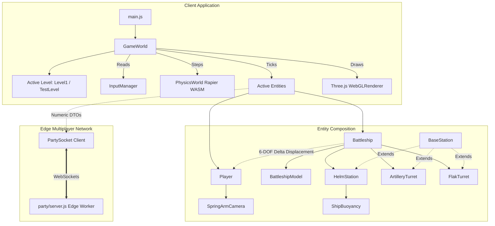
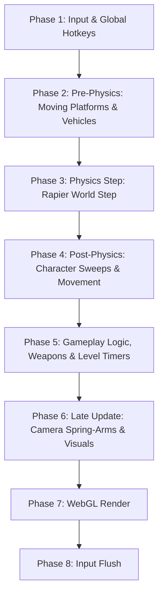

# ScopeCreep: Systems & Architecture Documentation

> **Project:** ScopeCreep (3D Cooperative Naval & Aviation Combat Game)  
> **Course:** Computer Graphics & Visualization (CGV)  
> **Core Technologies:** Three.js (WebGL), Rapier 3D (WebAssembly Physics), Vite, Custom GLSL Shaders, PartyKit (Edge WebSockets), Yuka (Game AI).

---

## Table of Contents
1. [Project Overview](#1-project-overview)
2. [Architecture](#2-architecture)
   - [2.1 High-Level Architecture](#21-high-level-architecture)
   - [2.2 Core Systems](#22-core-systems)
   - [2.3 Entity Architecture](#23-entity-architecture)
   - [2.4 Level Architecture](#24-level-architecture)
   - [2.5 Rendering Architecture](#25-rendering-architecture)
   - [2.6 Physics Architecture](#26-physics-architecture)
   - [2.7 Networking Architecture](#27-networking-architecture)
   - [2.8 Level 2: The Beach](#28-level-2-the-beach)
   - [2.9 Level 3: The Village (in progress)](#29-level-3-the-village-in-progress)
3. [Execution Flow](#3-execution-flow)
   - [3.1 Startup & Bootstrapping](#31-startup--bootstrapping)
   - [3.2 Level Loading & Teardown](#32-level-loading--teardown)
   - [3.3 Frame Update: The 8-Phase Pipeline](#33-frame-update-the-8-phase-pipeline)
   - [3.4 Rendering & Camera Selection](#34-rendering--camera-selection)
4. [Repository Structure](#4-repository-structure)
5. [Component Reference](#5-component-reference)
6. [Development Workflows](#6-development-workflows)
   - [Creating a New Level](#creating-a-new-level)
   - [Debugging Physics & Colliders](#debugging-physics--colliders)
   - [Switching Between Levels](#switching-between-levels)
7. [Open Considerations & Gotchas (To Figure Out As We Go)](#7-open-considerations--gotchas-to-figure-out-as-we-go)
   - [Networking & Replication](#networking--replication)
   - [Entity Phase Contract](#entity-phase-contract)
   - [Projectiles & Object Pooling](#projectiles--object-pooling)
   - [Damage State Placement](#damage-state-placement)
   - [Enemy AI](#enemy-ai)

---

## 1. Project Overview

ScopeCreep is a 3D real-time naval and aerial combat simulation built natively for the web browser. Players navigate an open ocean environment aboard a guided-missile destroyer, operating stations (helm steering, forward twin heavy artillery, aft quad anti-aircraft flak) or moving on foot across the pitching and rolling decks of the vessel.

### Fundamental Graphics vs. Physics Concepts

A foundational principle of this project is the strict decoupling of **Visual Representation** from **Physical Simulation**:

| Concept | Subsystem | Purpose | Representation in Code |
| :--- | :--- | :--- | :--- |
| **Mesh** | Graphics (Three.js) | Visual 3D geometry rendered to screen. Consists of vertices, faces, and normals. | `THREE.Mesh(geometry, material)` (e.g. detailed hull, antennas, railings). |
| **Collider** | Physics (Rapier 3D) | Invisible mathematical boundary used for collision sweeps, penetration resolution, and contacts. | `RAPIER.ColliderDesc.cuboid(...)` or `capsule(...)` attached to rigid bodies. |
| **Material** | Graphics (Three.js) | Surface optical properties (color, roughness, metalness, transparency, light reflectance). | `THREE.MeshStandardMaterial` or custom `THREE.ShaderMaterial`. |
| **Shader** | GPU (GLSL) | Micro-programs executed per-vertex and per-pixel directly on the graphics card. | `ocean.vert.glsl` (Gerstner waves) and `ocean.frag.glsl` (Fresnel reflection/foam). |

#### Why Colliders Differ from Meshes in ScopeCreep:
1. **Performance:** Visual meshes have thousands of polygons for cosmetic details. Passing visual meshes to physics would degrade framerates. ScopeCreep uses simplified **Compound Cuboid Colliders**.
2. **Tunneling Prevention:** Visual walking decks are thin planes ($0.05\text{m}$). Fast-moving characters can tunnel through thin planes. The physics colliders in ScopeCreep are solid **$3.5\text{m}$ deep slabs**, making tunneling physically impossible.
3. **Kinematic Timing:** Visual meshes move via animation clocks. Physical colliders must be transformed explicitly *before* collision sweeps run so characters sweep against current positions.

---

## 2. Architecture

### 2.1 High-Level Architecture

The game follows a decoupled coordinator architecture. A central `GameWorld` owns the canvas, WebGL renderer, root scene, clock, physics engine, and level stage lifecycle (`loadLevel`). Domain-specific actors live as modular `Entities`.


```mermaid
flowchart TD
    subgraph Client Application
        M[main.js] --> GW[GameWorld]
        GW --> LVL[Active Level: Level1 / TestLevel]
        
        GW -->|Reads| IM[InputManager]
        GW -->|Steps| PW[PhysicsWorld Rapier WASM]
        GW -->|Ticks| ENT[Active Entities]
        GW -->|Draws| RND[Three.js WebGLRenderer]
    end

    subgraph Entity Composition
        ENT --> BS[Battleship]
        ENT --> PL[Player]
        PL --> SAC[SpringArmCamera]
        BS --> BM[BattleshipModel]
        BS --> SC[HelmStation]
        SC --> SBY[ShipBuoyancy]
        BS --> AT[ArtilleryTurret]
        BS --> FT[FlakTurret]
        BST[BaseStation] -.->|Extends| SC
        BST -.->|Extends| AT
        BST -.->|Extends| FT
        BS -.->|6-DOF Delta Displacement| PL
    end

    subgraph Edge Multiplayer Network
        ENT -.->|Numeric DTOs| PS[PartySocket Client]
        PS <===>|WebSockets| PK[party/server.js Edge Worker]
    end
```

---

### 2.2 Core Systems

The engine infrastructure is stage-agnostic and located in `src/core/`:
- **`GameWorld`:** Master engine coordinator. Owns the animation loop, Three.js scene graph hierarchy (`environmentGroup`, `entitiesGroup`, `projectilesGroup`, `effectsGroup`), master clock, camera selection, stage lifecycle management (`loadLevel`, `restartCurrentLevel`), and dispatches the execution pipeline.
- **`PhysicsWorld`:** Wrapper for `@dimforge/rapier3d-compat` (WebAssembly). Manages gravity, rigid bodies, colliders, character controllers, and extracts high-contrast debug lines via `debugRender()`.
- **`InputManager`:** Centralized input mapper. Captures raw keyboard and mouse events, manages browser pointer lock for FPS mouselook, and maps keys to semantic action bindings (`forward`, `jump`, `toggleColliders`). Clears single-frame transitions at the end of every frame.
- **`UIManager` (`src/ui/UIManager.js`):** Central UI coordinator owned by `GameWorld` (`gameWorld.ui`). Manages modular DOM overlays (interaction prompts, station telemetry HUDs, crosshairs, warship health meter, toast notifications, FPS display, controls helpers, and dev tools) styled exclusively through `src/ui/ui.css`. Entities and levels never inject inline DOM or CSS.
- **`FPSTracker`:** Real-time on-screen HUD performance and framerate diagnostic widget.
- **`RenderQuality`:** The graphics settings. The player chooses them, and the game recommends settings for their computer.
  - **Settings:** resolution as a share of the screen's full resolution (`RESOLUTION_CHOICES`: 100%, 85%, 70%, 55% or 40%), or `'auto'`, plus shadows on or off. The player picks them in Options (Esc) → Graphics (`GraphicsSettings`), and the choice is saved in `localStorage`.
  - **Auto:** once a second it checks the median frame time. Below about 28 fps it lowers the resolution a step, and above about 50 fps it raises it again. It never changes shadows.
  - **Recommendation:** at first it comes from the graphics card. A software renderer (no GPU in use, e.g. SwiftShader or the Microsoft Basic Render Driver) gets 40% with no shadows; a GPU gets 100% with shadows. After that it follows the frame rate measured during gameplay: lighter settings below 30 fps, one step sharper at 50 fps or more. The menu shows the reason, naming the card and the measured fps.
  - **First run:** the recommended settings are used. With a software renderer, GameWorld also creates the context without antialiasing and shows a warning toast.
  - **FPS display:** shows "N% res" while rendering below full resolution.

---

### 2.3 Entity Architecture & The Phase Contract

Entities are self-contained game actors with optional 3D meshes, physical colliders, and lifecycle update hooks.
- **Hierarchical Composition:** The `Battleship` acts as a composite vessel entity:
  - Procedural 3D CAD mesh construction is delegated to **`BattleshipModel`** (`src/entities/models/BattleshipModel.js`).
  - Wave height multi-probe sampling and inertial pitch/roll/heave damping are delegated to **`ShipBuoyancy`** (`src/entities/ship-components/ShipBuoyancy.js`).
  - Operational vessel stations (**`HelmStation`**, **`ArtilleryTurret`**, **`FlakTurret`**) inherit from **`BaseStation`** (`src/entities/ship-components/BaseStation.js`).
- **Interactive Stations (`BaseStation`):** Unifies proximity detection fields, deck indicator pulsing, player limbo teleportation (`y = -100`), dedicated station cameras, HUD overlays, and precise relative deck coordinate mapping (`getShipRoot()`) so dismounting safely restores the player to the moving vessel deck.
- **Spring Arm Camera Subsystem (`SpringArmCamera`):** Decoupled into `src/entities/player-components/SpringArmCamera.js`. Manages Rapier obstacle occlusion raycasts, smooth spring arm compression/expansion, and seamless toggling between First-Person eye view and Third-Person orbit view.
- **Moving Platform Delta Kinematics:** To allow characters to walk naturally on a moving, pitching warship deck without slipping or phasing, `Battleship` calculates its exact 6-DOF world transformation delta between frames (`getPlatformDisplacement`). The `Player` (`CharacterController`) samples this displacement and adds it directly to its kinematic sweep.

#### The Entity Phase Contract (`BaseEntity.js`)
To prevent 1-frame kinematic lag, character tunneling, and camera jitter, entities must not dump all logic into an unordered `update(dt)`. Instead, all dynamic actors inherit from `BaseEntity` and adhere to a strict **phase contract**:

| Entity Category | Concrete Examples | Required Lifecycle Hook | Why It Must Run in This Phase |
| :--- | :--- | :--- | :--- |
| **Kinematic Platforms & Vehicles** | `Battleship`, elevators, cranes, moving docks | **`prePhysicsUpdate(delta, gameWorld)`** | Must compute motion and update Rapier transforms **BEFORE** the physics step so platforms are already in place when characters sweep. |
| **Controlled Characters & Actors** | `CharacterController`, deck crew, foot soldiers | **`postPhysicsUpdate(delta, gameWorld)`** | Must sweep **AFTER** platforms have moved and physics has stepped, inheriting platform deltas to collide with the current frame's surfaces. |
| **Weapons, Projectiles & Ballistics** | `MainGun`, `FlakTurret`, artillery shells, torpedoes | **`gameplayUpdate(delta, gameWorld)`** | Advances trajectories, weapon cooldowns, and collision raycasts against the settled physics state of the current frame. |
| **Cameras & View Tracking** | 1st/3rd person camera, gun sight, spring-arm, crosshairs | **`lateUpdate(delta, gameWorld)`** | Positions camera **AFTER** all actors and platforms have finished moving to prevent visual camera stutter. |
| **Stationary Props / Scenery** | Crates, radar masts, buoys, static obstacles | *None* | Zero update overhead; static colliders never move. |

---

### 2.4 Level Architecture

Levels represent isolated game stages that extend the abstract `BaseLevel` class:
- **`BaseLevel` Contract:** Provides resource tracking (`trackDisposable`) and lifecycle hooks (`init`, `update`, `dispose`). When a level is torn down, all tracked meshes, geometries, materials, lights, and colliders are released from GPU memory.
- **`Level1` (Operational Mission Stage):** Dynamic Gerstner wave ocean surface, atmospheric lighting, battleship combat, ocean safety plane ($Y = -1.0$), void fall recovery ($Y < -15\text{m}$), and developer inspection cameras.
- **`TestLevel` (Ground Sandbox Stage):** Flat static ground plane with coordinate grid, battleship, and standalone artillery stations at $Y = 0$. Designed for fast calibration of weapon traverse and locomotion without wave motion.
- **`IslandLevel`:** The base class for the on-foot levels on the island. It holds the island, cover, player and weapons, both squads, alien spawning, downed and revive, concealment, low health, the controls card and the mission result. Each level fills in hooks: `_environmentOptions`, `_coverOptions`, `_buildWorld`, `_clearings`, `_playerSpawn`, `_createProps`, `_startScenario`, `_updateScenario`, `_updateWorld`, `_onPlayerKilled`, `_resultText`, `_lowHealthHint`, `_isWalkable`. `_respawnPlayer(delta, point, message)` brings a lost player back after `respawnSeconds` (used by Level 3's revive points and the sandboxes). `SandboxTools` gives the island test levels the aerial camera (F1), alien spawning (F3), the squad toggle (F4) and respawning.
- **`Level02` and `Level02TestLevel` (The Beach):** On-foot island combat and its sandbox. See [2.8 Level 2: The Beach](#28-level-2-the-beach).
- **`Level03` and `Level03TestLevel` (The Village):** The night finale and its sandbox. See [2.9 Level 3: The Village](#29-level-3-the-village-in-progress).
- **Controls card:** A level may override `get controls()` to list the actions its controls card should show; `null` (the default) keeps Level 1's card.

---

### 2.5 Rendering Architecture

- **Renderer:** `THREE.WebGLRenderer` configured with antialiasing, high-performance power preference, and soft PCF shadow maps (`PCFSoftShadowMap`).
- **Gerstner Wave Ocean (`WaterMesh`):** Rather than flat geometric planes, the ocean surface is a $2400 \times 2400\text{m}$ subdivided plane ($200 \times 200$ segments) displaced dynamically on the GPU via custom GLSL shaders (`ocean.vert.glsl`).
- **Optical Shading (`ocean.frag.glsl`):** Computes Fresnel reflection equations to blend luminous deep cobalt (`#1a4b6e`) into shallow cyan crests (`#2ca0b8`), applies Blinn-Phong specular sun reflections, overlays procedural foam on wave crests exceeding threshold height, and blends into atmospheric horizon fog.

---

### 2.6 Physics Architecture

- **Rapier 3D WebAssembly:** Compiles deterministic Rust collision pipelines into the browser.
- **Kinematic Character Controller:** Uses Rapier’s specialized character controller with:
  - Auto-stepping over obstacles and curbs up to $0.4\text{m}$ high.
  - Slope climbing angles up to $50^\circ$.
  - Slope sliding for inclines $> 50^\circ$.
  - Downward ground snapping ($0.3\text{m}$) to eliminate hopping when descending stairs/ramps.
- **Compound Cuboids vs. Trimeshes:** Decks and ramps are modeled using compound cuboid boxes rather than raw trimeshes. Cuboid primitives eliminate internal edge "snagging" where characters trip over triangle seams.
- **Anti-Tunneling Slabs:** Decks feature $3.5\text{m}$ deep solid collision volumes, ensuring that even during high-velocity drops or severe wave pitches, characters cannot phase through floors.
- **Encapsulation via `PhysicsWorld`:** Entities and levels never import `@dimforge/rapier3d-compat` directly. All physics bodies, colliders, character controllers, and raycasts are routed through `PhysicsWorld` (or helper adapters like `ThreePhysicsAdapter` / `BattleshipColliders`), ensuring proper native resource disposal and debug visualization.

---

### 2.7 Networking Architecture (Work in Progress — To Be Figured Out)

Multiplayer edge scaffolding is currently set up with **PartyKit** via WebSockets (`partysocket`), but full replication is an unresolved problem that we will tackle iteratively once single-player systems are stable.

#### Guiding Rule: Keep Visuals Off the Server
The edge server runs headless without DOM, WebGL, GPU, or Three.js. If and when replication is wired up, the server should only exchange minimal numeric payloads, never Three.js scene objects:

```
                 Client Simulation
                         │
        ┌────────────────┴────────────────┐
        ↓                                 ↓
  Visual & Local State              Replication DTO
  (Three.js, Meshes, Cameras,       (Minimal numbers, booleans,
   Shaders, Raycasts, HUD)           no Three.js references)
                                          │
                                          ↓
                                     PartySocket
                                          │
                                          ▼
                                   PartyKit Server
                              (Headless Edge Worker)
```

- **Conceptual DTO Payloads:** Entities would only emit raw simulation numbers:
  ```json
  // MainGun snapshot idea:
  { "id": "gun_fwd", "yaw": 1.248, "pitch": 0.314, "firing": false }

  // Battleship snapshot idea:
  { "id": "ship_alpha", "x": 120.4, "z": -450.8, "heading": 1.57, "rudder": 0.5 }
  ```

#### Known Traps & Open Questions:
1. **Clock Drift on Waves:** Relying on shared `uTime` to recompute wave height locally only holds if clients stay in lockstep. In reality, background browser tabs throttle animation frames, compounding clock drift. Over time, clients will disagree on wave height at the same coordinate. A periodic server time-sync handshake will be needed before this can be trusted.
2. **Turret World-Space Aiming:** If a client's sampled wave pitch/roll drifts even slightly, the physical muzzle position in world space will diverge, complicating hit detection.
3. **Verdict:** We do not have multiplayer replication fully solved. We will prototype it incrementally as we go.

---

### 2.8 Level 2: The Beach

Level 2 is fought on foot. The squad lands from the anchored warship onto the south beach of the island and holds it against three waves of aliens coming down from the village, then pushes inland to the jungle path. All of its code is new and lives in its own files; shared engine files only gained small, opt-in additions.

**Flow (`Level02`):** opening (10 s camera sweep) -> `landing` (until the player is ashore, or `firstWaveTriggerSeconds`) -> `waves` -> `objective` (reach the beacon) -> `won`. The result screen offers Retry or Play again, and Main menu. `Level02TestLevel` extends it as the sandbox: training dummies, a respawning alien group, player respawn instead of failure, and dev keys.

**Downed, revive and healing:**
- At 0 health the player (or a squadmate) is downed, not killed. Aliens ignore the downed, because `Perception` skips anyone whose health `isDead`.
- `HumanSquad` sends the nearest squadmate who is on their feet. It runs over and holds still beside them for `revive.holdSeconds`, then revives them with `revive.healthFraction` of their health.
- The player revives a downed squadmate by holding [E] (`specialAction`) beside them. Letting go starts over.
- Anyone not revived within `revive.bleedOutSeconds` is lost. For the player, that, or going down with nobody left standing, fails the mission (the sandbox respawns instead).
- The supply crate refills ammo and health, and a hint points to it when health falls below `player.vitals.lowHealthFraction`.
- Shared hooks: `HealthComponent.revive(amount)` and `GroundCombatant.revive(health)` / `onRevived()`.

**World (`src/levels/level02/`)**
- `BeachEnvironment`: the island. Procedural terrain mesh plus a matching Rapier heightfield (the grid is shifted 0.173 m off round coordinates, because a vertical ray through an exact grid corner can slip between heightfield triangles), a calm sea, a sunset or night sky and clouds, and fog. It has two layouts: `'beach'` for Level 2 and `'village'` for Level 3, which has a bigger north end. Public helpers: `heightAt`, `slopeAt`, `pathCentreX`, `pathDistance`, `sunDirection`, `village`, `isInVillage` (where Level 3's houses go) and `scatterBounds`.
- `LandingZone`: the battleship anchored offshore (`AnchoredShip`, a static copy of Level 1's ship), the boarding ramp and gangway (ramps, not steps; solid handrails), the two helicopter bays, and spawn points (`gangwayTop`, `gangwayFoot`, `supplyCrate`). `flyInHelicopters()` sends the helicopters back out to sea and lands them (`HelicopterArrival` flight path plus `RotorWash` sand and spray); their cover colliders only switch on at touchdown.
- `BeachCover`: instanced trees, rocks and bushes with convex-hull rock colliders and trunk cylinders. The scenery is split into 120 m map tiles (`THREE.LOD` each). Tiles off screen are culled, tiles beyond 170 m use low-detail models, and tiles beyond 720 m (lost in the fog) are not drawn. AI helpers: `findCover(from, threat, ...)` (the edge of a tall rock, so a shooter in cover still has a line of fire), `isInBush`, `updateConcealment(actor)`, `isClearOfSolids`.
- `ObjectiveBeacon`, `SupplyCrate` (press [E] to refill machine-gun reserve ammo and health), and `LandingCinematic` (the opening sweep; it ends exactly on the player's spring-arm view, and [Space] or [Enter] skips it).

**Combatants (`src/entities/`)**
- `GroundCombatant`: base for every AI soldier. Kinematic capsule with its own character controller, `HealthComponent`, `faction`, and steering: `moveTo`, `stop`, `lookAt`, feeler rays and a stuck detour. Phase 4 moves it, Phase 5 runs the subclass brain, Phase 6 poses the model.
- `enemies/AlienCombatant` (shared patrol, investigate and search states, hearing, squad call-outs, `assault(point)`; subclasses may add states and pick the first one), `AlienTrooper` (fights from the edges of cover, flanks a target that stays dug in, plasma bursts), `AlienBrute` (charge and overhead slam; its back pack takes double damage through `damageMultiplierAt`), and Level 3's boss `AlienWarden` (see 2.9).
- `allies/SquadMate`: our AI soldier. Orders are `walkRoute(points)`, `follow()` (a place in formation) and `hold(point, facing)`. A follower with a wall in the way follows the leader's trail around it, and runs to catch up when far behind. It fights from cover near its post without straying beyond `leashRadius`, and turns on whoever shoots it.
- Models: `AlienModel`, `SoldierModel`, `HelicopterModel`. Character models merge each rigid piece into one solid and one glow mesh (`rendering/MeshMerge.js`), about 6 to 8 draw calls per character. Only an alien's body casts a shadow (limbs and rifle do not), which keeps big waves cheaper in the shadow pass.

**AI coordination (`src/ai/`)**
- `StateMachine` (states are `{ enter, update, exit }`; `update` returns the next state's name) and `Perception` (sight range and field of view with a line-of-sight ray, a shorter range against concealed targets, hearing, last known position).
- `AlienSquad`: registers aliens, gives them targets and cover, passes call-outs and gunshot noise, counts kills and clears corpses.
- `HumanSquad`: the leader (the player) plus `SquadMate`s. It provides formation places that turn with the leader's travel direction, the enemy list, shared tracers, and gunshot reporting. It also runs downed and revive: who is down and for how long (`isDowned`, `bleedOutLeft`), sending revivers, `reviveMember`, and bleed-out. Its `members` array is passed as `AlienSquad.targets`, so the aliens hunt the whole squad.
- `WaveDirector`: spawns each wave's units round-robin across its lanes, at most `maxAlive` at a time, waits for the wave to be cleared, then pauses before the next.

**Weapons (`src/weapons/`):** `WeaponController` (the player's machine gun and knife, switching, aiming down sights, recoil and HUD), `HitscanWeapon` (no friendly fire: a shot stops on a teammate but does not hurt them), `MeleeWeapon` (backstab bonus), `WeaponEffects` (pooled tracers, impacts, muzzle flash) and `WeaponModels`.

**Rendering additions (`src/rendering/`):** `Terrain`, `Vegetation` (instanced scatter), `Noise`, `SkyDome` (sunset gradient and sun disc, drawn at infinity around the camera; its horizon colour is the fog colour), `Clouds` (one instanced mesh following the camera) and `MeshMerge`.

**UI additions (`src/ui/components/`):** `StatusIndicator`, `WeaponHUD`, `PlayerHealthBar`, `DamageFlash`, `ObjectivePanel`, `MissionResult`, `CinematicOverlay` (letterbox bars; it hides the gameplay HUD through the `ui-cinematic-active` class), `GraphicsSettings` (the Graphics section of the Options menu) and, for Level 3, `BossHealthBar` (a boss's name and health under the objective, blue while shielded) and `Credits` (the end credits rolling up the screen; the HUD hides through `ui-credits-active`). A level can list its own controls (`get controls()` on `BaseLevel`); `GameWorld` turns their action names into key names with `InputManager.describeActions` for the controls card.

**Balance (`config.json`):** `player.vitals`, `revive`, `weapons.machineGun`, `weapons.knife`, `projectiles.plasma`, `enemies.trooper`, `enemies.brute`, `allies` (`crewSize`, `squadMate`) and `levels.level02` (wave list, `maxAliveAliens`, timings, radii).

**Dev keys (sandbox):** [F1] aerial camera, [F3] spawns a trooper ahead ([Shift]+[F3] a brute), [F4] toggles the AI squad, and in the Level 3 sandbox [F6] starts the fight with the Warden.

**Tests:** `npm test` covers all of the above (see `tests/README.md`).

---

### 2.9 Level 3: The Village (in progress)

Level 3 is the finale, at night: the squad comes up the jungle path to the village on the plateau at the island's far end, fights through its streets to the square, brings down the force field over the hall, defeats the Warden inside and frees the hostages. It is being built in phases: night village, the Warden, generators and dome, the street fight and revive points, the opening, cages and the dawn ending (all done), then polish.

**Done so far:**
- `Level03` (`IslandLevel`): night look (`BeachEnvironment` with `look: 'night'`: moon, stars, cool moonlight, dark haze) on the `'village'` island layout, the village, the player and crew arriving on the jungle path below the gate, and a supply crate inside the gate. States: `'generators'` (shut down the three generators) -> `'guards'` (wave 2 at the sealed hall) -> `'hall'` (the way in is open: get inside) -> `'boss'` -> `'victory'` -> `'hostages'` -> `'ending'` -> `'credits'` -> won. The mission does not fail: a lost player comes back at the last revive point. The moon's shadow area (240 m across) follows the camera (`shadowFollowsCamera`). `Level03TestLevel` adds a respawning alien group in the first streets and the shared `SandboxTools`.
- `BeachEnvironment` layouts: `'beach'` (Level 2, unchanged) and `'village'` (Level 3), where the island's northern half grows wider and longer to carry an oval village plateau 400 m across and 490 m long, about 6 times the old one. The south (beach, hills, jungle path) is identical. Helpers: `village` (`x`, `z`, `halfWidth`, `halfLength`, `height`), `isInVillage(x, z, margin)`, `distanceOutsideVillage`, `scatterBounds` (used by `BeachCover`).
- `level03/Village`: a big old village laid out from a fixed seed:
  - Streets: an avenue from the gate to the square, 5 cross streets and 4 side streets.
  - About 260 houses facing the streets and the square, of three kinds:
    - closed: some two storeys, with doors shut, hanging open, boarded or gone, and sagging porches;
    - walk-in: walls, a doorway, a crate for cover, and a ceiling collider so the camera stays inside;
    - ruins.
  - Creepy details on the houses: crooked roofs (some caved in to bare rafters), chimneys, boarded, broken and shuttered windows (a candle or something green behind a few), broken fences, and glowing alien vines and pods.
  - Around them: empty lots with dead trees and old wells, more dead trees, crates and barrels at the street sides, and a graveyard by the hall (crooked headstones and crosses, open graves, a crypt).
  - 5 landed alien saucers up on legs (you can walk and hide under them), with glowing undersides, rim lights, ramps and crystals growing around them.
  - Lamp posts: most are dead or only glow; 3 have real lights.
  - All static parts are merged by `BuildingKit` into two meshes per 100 m tile, so tiles out of view are skipped and near ones draw first. It exposes `houses`, `lots`, `ships`, `streets`, `square`, `gate`, `graveyard`, `spawnPoints` and `isOpenGround(x, z, margin)`.
- Squadmates in streets: `HumanSquad` records the leader's path (the trail). A follower with a wall between it and its post (`PhysicsWorld.isLineClear`, which ignores characters) walks the trail around it (`routeTowards`), and runs at `catchUpSpeed` when more than `catchUpDistance` behind. Level 3 also keeps formation places out of the houses (`_isWalkable`).
- `level03/VillageHall`: the hall on the north side of the square, with an entrance facing the square, glowing windows, 2 rows of pillars with alien conduits, a dais at the back for the Warden and a green interior light. It exposes `entrance`, `doorway`, `pillars`, `dais`, `bounds` and `contains()` for the later phases.
- `level03/BuildingKit`: boxes (with yaw, pitch and roll), gable roofs (tilted for sagging), pillars, lathe shapes (saucer hulls, domes) and crystals, with matching static colliders. Everything is merged at the end (`finish(name, { tileSize })`).
- The force field and its generators:
  - **`level03/ForceFieldDome`:** a glowing hemisphere of hexagons over the hall (a `ShaderMaterial` with `forcefield.vert.glsl` / `forcefield.frag.glsl`: fresnel rim, hexagon lattice, rolling energy bands, drawn additively, no fog so it shows from the far end of the village). A static ball collider (`PhysicsWorld.createStaticBall`) keeps people and bullets out. `collapse()` removes the collider at once and flickers the dome out (`'up'` -> `'collapsing'` -> `'down'`); `blocks(x, z)` keeps formation places out from under it.
  - **`level03/ShieldGenerator`:** an entity standing a few meters past the ramp of three of the landed ships (`Village.generatorSpots`). It has a lit spinning core and a beam to the top of the dome. Hold [E] (`specialAction`) within `radius` for `holdSeconds` to shut it down; the progress drains at `drainPerSecond` when you let go. Shut down, its light (intensity 0, so the light count and shaders stay the same), glow and beam go out.
  - **Flow:** the objective counts the generators that are down and gives the distance to the nearest one still running. When the last one goes down the dome collapses and wave 2 begins. `shutDownGenerators({ instant })` skips wave 2 (dome gone, straight to `'hall'`) for the sandbox and the tests.
- Aliens that never run out (`level03/AlienSpawner`):
  - **The spawner:** keeps up to `maxAlive` of its aliens alive. It brings a new one every `interval` seconds, from any direction on a ring round a centre, on open ground (`_isWalkable`), at least `spawnMinPlayerDistance` from the player and out of their sight when it can. Each new alien is sent to `assault()` its target.
  - **Round the player:** from the moment the player is in the village (`streetAliens`).
  - **Round each generator:** while it runs and the player is within `activeRange` (`generatorDefense`, which also adopts the generator's `guards`). Shutting the generator down stops its spawner.
  - **Cap:** all spawners stop at wave 2, and none spawn while the level has `maxAliveAliens` alive.
- Wave 2 (`'guards'`):
  - The hall's door is sealed by a `ForceFieldWall` (the force-field shader, flat, with a box collider).
  - The aliens still about fall back to guard it. Fresh ones (`hallWave`: brutes first) make up the starting guard, at posts round the door and the square.
  - Then more keep appearing beside the hall on both sides (two `AlienSpawner`s just outside its side walls, `sideMaxAlive` each, every `reinforceSeconds`) and push round to the door.
  - When `killsToOpen` aliens have been killed since wave 2 began (`hallWaveKills`), the spawners stop and the seal collapses (`'hall'`).
- Opening and ending:
  - **Opening:** `LandingCinematic`, now configurable with `flightPath`, `defaultFocus`, `aimPoint`, `aimTowards`, `endOnPlayer`, `easing` and `holdSeconds`. It holds inside the hall on the Warden among its caged prisoners, backs out of the door, climbs about 200 m over the village (the whole street grid, the ships, the beams), and comes down over the rooftops to the gate, ending on the player's view ("THE VILLAGE"). The Warden stands in the hall, dormant, from the start (`BossArena.place()`; `start()` wakes it). It is marked `isBoss`, so it is left out of wave 2, of the respawn confusion, and of `clearAliens()`.
  - **Hostages (`level03/HostageCage`):** four islanders (unarmed `SoldierModel`s in plain clothes) in cages of glowing bars at `VillageHall.cageSpots`, between the pillars and the side walls. A cage is locked until the Warden falls; then hold [E] (`hostages.holdSeconds`) to free its islander. Freed, the bars sink, the collider goes and the islander cheers.
  - **The Warden's death:** every alien left falls with it, and after `victoryDelaySeconds` the state moves to `'hostages'`.
  - **Dawn:** with all four free, the `'ending'` camera (`endOnPlayer: false`) leaves the hall through its door and climbs over the village while `BeachEnvironment.blendLook('night', 'dawn', t)` moves the sky, stars, fog, sun, hemisphere light, clouds and sea from night to the new `'dawn'` look.
  - **Credits:** `ui.showCredits(CREDITS, seconds, hint)` (component `Credits`, text in `level03/credits.js`) rolls them over the dawn with the gameplay HUD hidden; [Space] skips them (not with the press that skipped the ending). Then the mission result.
- Revive points (`level03/RevivePoint`, 5): inside the gate, on the nearest street to the west and east generators, on the square, and just inside the hall door (counted only from inside).
  - Each is a post with a lamp and a light column: amber until reached, teal after, with no point light.
  - Lost (bled out, or nobody left to revive them), the player comes back at the last one reached (`_onPlayerKilled` -> `_respawnPlayer`), and the living squad regroups there.
  - The aliens lose the player (`confuseAliens`): every one forgets them, and those within `respawn.confusionRadius` of the spot wander off `respawn.wanderDistance` away from it (`AlienCombatant.wanderOff`). No spawner brings anyone for `respawn.respiteSeconds`.
  - Each revive point has a supply crate (ammo and health) beside it, unless the gate's or the hall's crate is already close.
- Shields: `shield.pickups` `ShieldPickup`s lie along the streets (seeded, spread out). Walking into one charges the player's `PlayerShield` (`entities/player-components`) to `shield.health`. The shield is a faint bubble that takes hits before the player's health (`HealthComponent.absorb`), reddens as it wears down and breaks at zero, with a SHIELD bar over the health bar (`ui.updatePlayerShield`).
  - **Balance:** in `config.levels.level03.generator`.
- The Warden (boss fight in the hall):
  - **Flow (`Level03`):** once the force field is down, walking into the hall wakes the Warden (`startBossFight()`, state `'boss'`). Bringing it down wins after `victoryDelaySeconds` (state `'victory'`), for now; the hostages come in a later phase. A second supply crate stands just inside the hall door (`VillageHall.supplyPoint`).
  - **`level03/BossArena`:** runs the fight:
    - It places the Warden in front of its dais, shielded, fed by two `ShieldCrystal`s on the back pillars.
    - Once both crystals are destroyed, the shield drops.
    - Below `enrageFraction` health it enrages the Warden, grows two crystals on the front pillars, and sends `enrageAdds` troopers in from the square.
    - It drives the boss bar (`ui.showBossHealth` / `updateBossHealth(current, max, shielded)` / `hideBossHealth`, component `BossHealthBar`).
  - **`enemies/AlienWarden`** (an `AlienCombatant` that starts `'dormant'` until `awaken()`):
    - It holds the floor within `leashRadius` of its guard point.
    - It fires fans of plasma (`volleyBolts` over `volleySpreadDegrees`).
    - Every `slamSeconds` (sooner when someone is close) it raises its arms over a warning ring and slams the floor, sending out a `Shockwave`.
    - `setShielded()` sets `HealthComponent.invulnerable` and shows a bubble.
    - `enrage()` makes it attack faster (`enragedCadence`).
  - **`enemies/Shockwave`:** a ring that rolls out across the floor and hurts each grounded target once as it passes; feet higher than `shockwaveClearHeight` (a jump) clear it.
  - **`level03/ShieldCrystal`:** an alien-side entity with health and a static collider (so hitscan shots find it through `collider.userData.entity`), and a beam to the Warden. When shot it shatters and its collider goes.
  - **Hall floor:** `VillageHall.isOpenFloor()` lets squadmates take formation places anywhere in the hall except the pillars and the dais.
  - **Sandbox:** [F6] (`devBoss`) in `Level03TestLevel` drops the force field, takes the player and the squad to the hall door and starts a fresh fight; there is no mission result there. `GroundCombatant.teleport()` and `AlienSquad.remove()` support this.
  - **Balance:** all fight values live in `config.enemies.warden`.

**Budgets:** 8 point lights in Level 3: 3 lanterns, 1 under the ship by the square, 1 in the hall, and 1 on each of the 3 generators. The village is about 100k triangles in about 40 merged meshes.

---

## 3. Execution Flow

### 3.1 Startup & Bootstrapping
1. Browser loads `index.html` and executes `src/main.js`.
2. `bootstrap()` instantiates `GameWorld(canvas)` and awaits `gameWorld.init()`.
3. `PhysicsWorld.init()` downloads, compiles, and initializes the Rapier 3D WebAssembly binary.
4. `gameWorld.loadLevel()` loads the initial stage (e.g. `Level1` or `TestLevel`).
5. `gameWorld.start()` ignites the 60 FPS animation loop.

---

### 3.2 Level Loading & Teardown
1. `gameWorld.loadLevel(newLevel)` is invoked.
2. If a stage is currently active, its `dispose()` method is called:
   - Level-specific colliders (e.g. ocean safety plane or ground plane) are removed from Rapier.
   - Dev tools DOM elements and event listeners are detached.
3. `gameWorld.clearEntities()` and `gameWorld.clearEnvironment()` wipe scene groups and dispose geometries/materials from GPU memory.
4. `newLevel.init()` builds the new stage environment, lights, and entities.

---

### 3.3 Frame Update: The 8-Phase Pipeline

To eliminate 1-frame kinematic lag and resolve moving platform dependencies, `GameWorld._loop()` executes an explicit **8-Phase Pipeline** every frame:


```mermaid
flowchart TD
    P1[Phase 1: Input & Global Hotkeys] --> P2[Phase 2: Pre-Physics: Moving Platforms & Vehicles]
    P2 --> P3[Phase 3: Physics Step: Rapier World Step]
    P3 --> P4[Phase 4: Post-Physics: Character Sweeps & Movement]
    P4 --> P5[Phase 5: Gameplay Logic, Weapons & Level Timers]
    P5 --> P6[Phase 6: Late Update: Camera Spring-Arms & Visuals]
    P6 --> P7[Phase 7: WebGL Render]
    P7 --> P8[Phase 8: Input Flush]
```

1. **Phase 1: Input & Global Hotkeys:** Checks single-frame inputs (e.g. `[F2]` / `[B]` collider toggle).
2. **Phase 2: Pre-Physics (`prePhysicsUpdate`):** Moving platforms and vehicles (`Battleship`) calculate wave buoyancy, rudder, and update their Three.js transforms. Kinematic rigid bodies are updated in Rapier **before** the physics step.
3. **Phase 3: Physics Step (`physics.step`):** Rapier advances the world simulation with all platforms already at their current frame coordinates; updates debug lines.
4. **Phase 4: Post-Physics (`postPhysicsUpdate`):** Kinematic actors (`CharacterController`) inherit platform deltas, execute collision sweeps against the freshly positioned ship, and update positions with **zero latency**.
5. **Phase 5: Gameplay Logic (`gameplayUpdate` / `update`):** Level timers advance; standalone weapons, projectiles, and unphased entities update.
6. **Phase 6: Late Update (`lateUpdate`):** Follow cameras position themselves, spring-arm collision raycasts prevent camera clipping through walls, and reticles align.
7. **Phase 7: WebGL Render:** `renderer.render(scene, getActiveCamera())` draws the scene.
8. **Phase 8: Input Flush (`input.update`):** Single-frame key transitions (`keysJustPressed`, `mouseDelta`) are cleared.

---

### 3.4 Rendering & Camera Selection
`GameWorld` supports dynamic active cameras. Passing a camera to `gameWorld.setActiveCamera(cam)` seamlessly redirects the rendering pipeline:
- **Player Camera:** Controlled by `CharacterController` (1st person eye level or 3rd person spring-arm orbit).
- **Gun Sight Camera:** Controlled by `MainGun` or `FlakTurret` (aligned along barrel bore with $40^\circ$ optical zoom).
- **Developer Aerial Camera:** Free-orbit inspection camera available in `Level1` dev tools.

---

## 4. Repository Structure

```
ScopeCreep/
├── dist/                   # Production WebGL distribution bundle (Vite build output)
├── party/                  # Serverless WebSocket multiplayer edge worker scripts
│   └── server.js           # PartyKit connection handling & DTO packet routing
├── public/                 # Static public assets (icons, sounds, models)
├── src/
│   ├── core/               # Engine foundation (Stage-agnostic systems)
│   │   ├── GameWorld.js    # Central coordinator: canvas, loop, scene, renderer, clock, levels
│   │   ├── PhysicsWorld.js # Rapier 3D WASM physics wrapper & debug line generator
│   │   ├── InputManager.js # Keyboard, mouse, pointer lock, and semantic action map
│   │   └── FPSTracker.js   # Real-time framerate and frame time HUD performance monitor
│   ├── entities/           # Concrete game actors and interactive objects
│   │   ├── BaseEntity.js   # Abstract lifecycle contract (prePhysics/postPhysics/gameplay/lateUpdate)
│   │   ├── Battleship.js   # Guided-missile destroyer assembly, decks, citadel, colliders
│   │   ├── Player.js       # Human avatar, dual camera, kinematic physics sweep
│   │   ├── components/     # Reusable entity components
│   │   │   └── HealthComponent.js # Basic health tracking (KINETIC and EXPLOSIVE damage)
│   │   ├── models/         # 3D procedural geometry builders
│   │   │   └── BattleshipModel.js # Destroyer hull, superstructure, stairs, collider slabs
│   │   ├── player-components/     # Modular player sub-systems
│   │   │   └── SpringArmCamera.js # 1st/3rd person camera, occlusion raycasting, arm compression
│   │   ├── projectiles/    # High-performance object-pooled ballistics
│   │   │   ├── Projectile.js      # Ballistic trajectory, gravity arc, CCD raycast sweep
│   │   │   └── ProjectilePool.js  # Zero-allocation pool (Flak, Artillery)
│   │   └── ship-components/# Specialized naval stations and subsystems
│   │       ├── BaseStation.js     # Abstract station lifecycle (mount, dismount, proximity, deck return)
│   │       ├── ShipBuoyancy.js    # 5-probe wave sampling, pitch/roll/heave damping
│   │       ├── HelmStation.js     # Maritime physics, bridge helm, chase camera
│   │       ├── ArtilleryTurret.js # Forward heavy twin naval artillery turret
│   │       └── FlakTurret.js      # Aft anti-air quad rapid-fire flak turret
│   ├── ai/                 # Level 2 AI: StateMachine, Perception, AlienSquad, HumanSquad, WaveDirector
│   ├── weapons/            # Infantry weapons: WeaponController, HitscanWeapon, MeleeWeapon, effects, models
│   ├── levels/             # Playable environments and stage logic
│   │   ├── BaseLevel.js    # Abstract base class with automated resource disposal
│   │   ├── Level01.js      # Operation Retake: Open ocean combat mission stage
│   │   ├── Level02.js      # The Beach: landing, three alien waves, objective
│   │   ├── Level02TestLevel.js # Level 2 sandbox: dummies, respawning aliens, dev keys
│   │   ├── level02/        # Island, landing zone, cover, opening sweep, helicopters, crate, beacon
│   │   ├── IslandLevel.js  # Base class for the on-foot island levels (Level 2 and 3)
│   │   ├── SandboxTools.js # Dev tools shared by the island test levels (F1/F3/F4, respawn)
│   │   ├── Level03.js      # The Village: the night finale (in progress)
│   │   ├── Level03TestLevel.js # Level 3 sandbox
│   │   ├── level03/        # Village, VillageHall, BuildingKit, ForceFieldDome (dome and door wall), ShieldGenerator, AlienSpawner, RevivePoint, BossArena, ShieldCrystal, HostageCage, ShieldPickup, credits
│   │   └── TestLevel.js    # Ground testing sandbox: Flat terrain, isolated weapon testing
│   ├── rendering/          # Visual WebGL components
│   │   ├── Ocean.js        # Subdivided ocean plane driving custom GPU shaders
│   │   ├── Terrain.js, Vegetation.js, Noise.js # Island terrain, instanced scatter, noise
│   │   ├── SkyDome.js, Clouds.js # Sunset sky and clouds
│   │   ├── MeshMerge.js    # Merges a model's rigid parts into a few vertex-coloured meshes
│   │   └── shaders/        # GPU shader programs (GLSL)
│   │       ├── ocean.vert.glsl # Vertex displacement shader (Gerstner wave math)
│   │       ├── ocean.frag.glsl # Fragment shader (Fresnel reflections, foam, depth colors)
│   │       └── sky.vert.glsl, sky.frag.glsl # Sky dome at infinity, sunset gradient and sun
│   ├── ui/                 # Centralized HTML/DOM HUD overlay subsystem
│   │   ├── UIManager.js    # Central UI orchestrator attached to GameWorld.ui
│   │   ├── ui.css          # Unified stylesheet for all HUD and overlay elements
│   │   └── components/     # Modular UI widgets (InteractionPrompt, StationHUD, HealthBar, etc.)
│   ├── main.css            # Base stylesheet, reset, HUD typography
│   └── main.js             # Client application bootstrap
├── tests/                  # npm test: Node test runner, real game code and physics (see tests/README.md)
├── index.html              # Single-page HTML container with WebGL canvas & UI overlays
├── package.json            # Node.js dependencies, scripts, and build configuration
└── vite.config.js          # Vite plugins (WASM, GLSL) and LAMP server relative base path
```

---

## 5. Component Reference

### `GameWorld` (`src/core/GameWorld.js`)
- `constructor(canvas)`: Initializes Three.js scene, renderer, groups, camera, and input.
- `init()`: Compiles Rapier WASM physics and adds debug line mesh to scene.
- `start()` / `stop()`: Controls the master `requestAnimationFrame` loop.
- `setActiveCamera(camera)`: Switches rendering to a custom camera (`null` restores default).
- `addEntity(entity)` / `removeEntity(entity)`: Manages active entity update roster.
- `clearEntities()` / `clearEnvironment()`: Completely disposes scene groups.
- `toggleColliderDebug()` / `setColliderDebugVisible(bool)`: Toggles physics debug lines.

### `PhysicsWorld` (`src/core/PhysicsWorld.js`)
- `init()`: Compiles `@dimforge/rapier3d-compat` and instantiates `RAPIER.World`.
- `step(delta)`: Advances physics simulation by delta time.
- `createGround(size)`: Creates massive static floor cuboid.
- `createCharacterController(opts)`: Instantiates Rapier kinematic character controller with auto-step and slope limits.
- `createCompoundCuboidsFromObject(obj)`: Generates compound cuboid colliders from mesh bounds.
- `updateDebug()`: Queries Rapier `world.debugRender()` and updates Three.js line buffers with high-contrast neon colors.

### `InputManager` (`src/core/InputManager.js`)
- `requestPointerLock(element)` / `exitPointerLock()`: Manages browser pointer lock.
- `isActionDown(name)`: Checks continuous hold of semantic action.
- `isActionJustPressed(name)` / `isActionJustReleased(name)`: Checks single-frame transitions.
- `getAxis(negAction, posAction)`: Returns float between $-1$ and $+1$.
- `update()`: Flushes single-frame key states at frame end.

### `UIManager` (`src/ui/UIManager.js`)
- Attached to `gameWorld.ui` and acts as the single point of entry for all DOM UI overlays.
- `showPrompt(key, label, accentColor, sourceId)` / `hidePrompt(sourceId)`: Interactive station entry/exit prompts.
- `showStationHUD(type, config)` / `updateStationHUD(type, data)` / `hideStationHUD()`: Full-screen station cockpits and telemetry panels.
- `showCrosshair(type)` / `hideCrosshair()`: Weapon reticles and crosshairs.
- `updateHealthBar(current, max)` / `hideHealthBar()`: Battleship integrity HUD meter.
- `showToast(message, type, duration)`: Mission notifications and gameplay toasts.
- `dispose()`: Cleans up DOM containers and child components during engine teardown.

### `FPSTracker` (`src/core/FPSTracker.js`)
- Performance diagnostic widget delegating rendering to `UIManager.fpsDisplay`.
- `update()`: Measures frame delta using `performance.now()`, updates rolling FPS and frame time in milliseconds (`ms`) every 150ms without visual jitter.
- Dynamic color-coding: Green/emerald ($\ge 55$ FPS), Amber/yellow ($30-54$ FPS), Red ($< 30$ FPS).
- `dispose()`: Safely unmounts DOM element upon engine cleanup.

### `BaseEntity` (`src/entities/BaseEntity.js`)
- `constructor(name)`: Sets entity name, registers `isEntity = true`, and initializes `this.mesh = null`.
- `prePhysicsUpdate(delta, gameWorld)`: Phase 2 contract hook. Moves platforms/buoyant bodies and updates Rapier transforms *before* the physics step.
- `postPhysicsUpdate(delta, gameWorld)`: Phase 4 contract hook. Sweeps characters and dynamic actors against moving platforms.
- `gameplayUpdate(delta, gameWorld)`: Phase 5 contract hook. Weapons, timers, ballistics, damage models, and state machines.
- `lateUpdate(delta, gameWorld)`: Phase 6 contract hook. Follow cameras, spring-arms, HUD reticles, and mesh fading.
- `dispose()`: Recursively traverses `this.mesh`, disposing all geometries, materials, and textures from GPU memory.

### `Battleship` (`src/entities/Battleship.js`)
- Composite naval vessel composed of `BattleshipModel`, `ArtilleryTurret`, `FlakTurret`, and `HelmStation`.
- `initPhysics(physicsWorld)`: Generates compound cuboid colliders ($3.5\text{m}$ deck slabs, ramps, bridge walls) from model bounds.
- `prePhysicsUpdate(delta)`: Delegates wave buoyancy and propulsion to `HelmStation`, and syncs Rapier rigid body transforms *before* physics step.
- `getPlatformDisplacement(pos, out)`: Computes exact 6-DOF world delta for standing characters to prevent deck slipping.
- `setColliderDebugVisible(bool)`: Toggles green wireframe box meshes.

### `BattleshipModel` (`src/entities/models/BattleshipModel.js`)
- `createBattleshipModel(stations)`: Procedural 3D model builder returning a `THREE.Group` with naval slate hull, charcoal deck, superstructure, observation windows, citadel reactor, stairs, and boarding ramp.
- Attaches tagged collider meshes (`mesh.userData.colliders`) with $3.5\text{m}$ anti-tunneling deck slabs.

### `Player` (`src/entities/Player.js`)
- `postPhysicsUpdate(delta)`: Reads movement inputs, inherits platform displacement from ship, and executes Rapier kinematic collision sweep.
- `lateUpdate(delta)`: Delegates camera positioning and obstacle occlusion raycasting to `SpringArmCamera`.
- `toggleCameraMode()`: Inverts between First-Person eye view and Third-Person orbit view via `SpringArmCamera`.
- `setMounted(bool)`: Suspends player movement and updates visibility when operating a station.
- `teleport(x, y, z)`: Warps character position directly in Rapier and Three.js.
- `setColliderDebugVisible(bool)`: Toggles cyan capsule wireframe mesh.

### `SpringArmCamera` (`src/entities/player-components/SpringArmCamera.js`)
- Dual-mode camera controller (`FIRST_PERSON` and `THIRD_PERSON`).
- `update(delta, targetPos, yaw, pitch)`: Computes focal tracking and executes Rapier obstacle occlusion raycasts against ship geometry and walls.
- Responsive spring physics: rapid collision compression ($28/\text{s}$) and smooth extension ($10/\text{s}$) to avoid clipping through bulkheads.
- Preallocated internal math scratchpads ensuring zero Garbage Collection overhead.

### `BaseStation` (`src/entities/ship-components/BaseStation.js`)
- Abstract base class for all operational vessel stations (`HelmStation`, `ArtilleryTurret`, `FlakTurret`).
- `createDetectField({ radius, color })`: Builds standardized circular deck proximity zone with animated pulsing ring.
- `checkProximity(delta, gameWorld)`: Tracks nearby players and controls "Press [E] to Enter" prompt visibility.
- `updateCooldown(delta)`: Per-frame cooldown timer management to ensure clean mount and dismount transitions.
- `mount(player, gameWorld)`: Bridges player into station, switches to station camera, records deck position relative to ship root via `getShipRoot().worldToLocal()`, and teleports player to safe limbo ($Y = -100$).
- `dismount(gameWorld)`: Restores player from limbo back to exact deck coordinates via `getShipRoot().localToWorld()`, re-enables locomotion, restores pointer lock, and reverts camera.

### `ShipBuoyancy` (`src/entities/ship-components/ShipBuoyancy.js`)
- Samples CPU wave heights from `Ocean.getWaveHeight` across 5 hull probe locations (Bow, Stern, Port, Starboard, Center).
- `update(mesh, water, delta)`: Calculates damped naval heave bobbing, longitudinal pitch, and lateral roll, smoothing transitions to prevent vessel snapping.

### `HelmStation` (`src/entities/ship-components/HelmStation.js`)
- Extends `BaseStation`.
- Owns `ShipBuoyancy` instance for vessel water interaction.
- `update(delta)`: Computes naval engine propulsion, rudder turn rate, water drag, and ship sway.
- Provides third-person naval chase camera mounted behind bridge.

### `ArtilleryTurret` & `FlakTurret` (`src/entities/ship-components/`)
- Extend `BaseStation`.
- `ArtilleryTurret`: Forward twin heavy naval cannon with azimuth traverse and optical gun-sight camera ($40^\circ$ zoom).
- `FlakTurret`: Aft quad rapid-fire anti-aircraft battery with high-angle elevation.
- `update(delta)`: Handles station proximity detection, mouse aiming, crosshair HUD display, and dismount inputs.

### `ProjectilePool` (`src/entities/projectiles/ProjectilePool.js`)
- High-performance, zero-allocation object pool for rapid-fire ballistics.
- Pre-allocates 100 Flak tracers and 30 Heavy Artillery shells upfront in `gameWorld.projectilesGroup`.
- `gameplayUpdate(delta, gameWorld)`: Runs in **Phase 5**, advancing all active trajectories and executing $O(1)$ swap-and-pop recycling upon impact or lifetime expiration.
- `fireFlak({ origin, direction, spread, source })`: Spawns high-velocity kinetic tracer ($460\text{ m/s}$, slight spread, 2.4s lifetime).
- `fireArtillery({ origin, direction, source })`: Spawns heavy explosive shell ($240\text{ m/s}$, gravity arc $-18\text{ m/s}^2$, 6.5s lifetime).

### `Projectile` (`src/entities/projectiles/Projectile.js`)
- Single physical projectile instance managing position, velocity, ballistic gravity, and drag.
- Continuous Collision Detection (CCD): Performs segment raycasting (`castRay`) from previous position to next position every frame, preventing tunneling through thin surfaces even at $500\text{ m/s}$.
- Detects surface impacts against Rapier colliders and ocean water plane ($Y \le 0$). Delivers `DamageInfo` (`KINETIC` or `EXPLOSIVE`) to target entity's `HealthComponent`.

### `HealthComponent` (`src/entities/components/HealthComponent.js`)
- Standalone health container focused strictly on basic damage mechanics.
- `DamageType`: Strict enum constrained to `KINETIC` and `EXPLOSIVE`.
- `DamageInfo`: Lightweight payload (`amount`, `type`, `source`).
- `HealthComponent`: Manages `currentHealth`, `maxHealth`, `isDead`, `invulnerable` (a shield: `takeDamage` does nothing while set), `absorb` (an optional `(amount) => left over` that takes hits first: the player's shield), `takeDamage(damage)`, `heal(amount)`, `reset()`, and `onDamage`/`onDeath` event callbacks.

### `Ocean` (`src/rendering/Ocean.js`)
- `update(delta)`: Advances shader `uTime` uniform.
- `getWaveHeight(x, z, time)`: Computes CPU wave height at world coordinates matching GPU shader math for vessel buoyancy.

---

## 6. Development Workflows

### Creating a New Level
1. Create `src/levels/MyTestLevel.js` extending `BaseLevel`:
   ```javascript
   import * as THREE from 'three';
   import { BaseLevel } from './BaseLevel.js';
   import { Player } from '../entities/Player.js';

   export class MyTestLevel extends BaseLevel {
     async init() {
       await super.init();

       // 1. Lighting
       const sun = new THREE.DirectionalLight(0xffffff, 1.0);
       sun.position.set(50, 100, 50);
       this.gameWorld.environmentGroup.add(sun);
       this.trackDisposable(sun);

       // 2. Ground & Physics Floor
       this.groundCollider = this.gameWorld.physics.createGround(200);

       // 3. Player
       this.player = new Player(this.gameWorld);
       this.player.setPosition(0, 0.2, 0);
       this.gameWorld.addEntity(this.player);
     }

     dispose() {
       if (this.groundCollider) {
         this.gameWorld.physics.world.removeCollider(this.groundCollider, true);
       }
       super.dispose();
     }
   }
   ```
2. Load it in `src/main.js`:
   ```javascript
   await gameWorld.loadLevel(new MyTestLevel(gameWorld));
   ```

### Debugging Physics & Colliders
- Press **`[F2]`** or **`[B]`** on the keyboard (or click **`🛡️ Colliders`** on the HUD).
- Visual color breakdown:
  - **Electric Neon Lime (`#1aff66`):** Kinematic bodies (Warship hull/decks, Character capsule).
  - **Electric Neon Magenta (`#ff3377`):** Static world bodies (Ocean safety plane, ground floor).
  - **Cyan Capsule (`#00f5d4`):** CharacterController physical hitbox ($r=0.5\text{m}, h=2.0\text{m}$).

### Switching Between Levels
In `src/main.js`:
```javascript
// Load Level 1 (At Sea Mission):
await gameWorld.loadLevel(new Level1(gameWorld));

// Load TestLevel (Flat Ground Sandbox):
await gameWorld.loadLevel(new TestLevel(gameWorld));
```

---

## 7. Open Considerations & Gotchas (To Figure Out As We Go)

Rather than declaring rigid, grand specifications upfront, the remaining systems will be developed iteratively with an eye on the following known traps and architectural questions:

### Networking & Replication
- **Status:** Unresolved. We will figure this out as we go once single-player mechanics feel solid.
- **Open Questions:** How much authority should the PartyKit edge server have? How do we handle browser tab throttling and clock drift on `uTime` without de-syncing wave heights? How do we decouple network tick rates (20–30 Hz) from 60 FPS rendering without introducing jitter? We will start with minimal prototypes rather than assuming we have it solved.

### Entity Phase Contract
- **The Gotcha:** The 8-phase pipeline (`prePhysicsUpdate`, `postPhysicsUpdate`, `lateUpdate`) currently works because `Battleship` and `CharacterController` explicitly opt into the right phases.
- **To Watch:** As new entities arrive (projectiles, drones, boats), each must correctly implement the right lifecycle hooks. If a new moving platform updates in `postPhysicsUpdate` instead of `prePhysicsUpdate`, it will immediately reintroduce the exact 1-frame lag bug we just fixed. A short phase contract or base class will keep this disciplined.

### Projectiles & Object Pooling (Resolved)
- **Implemented Solution:** `ProjectilePool` pre-allocates 100 Flak tracers and 30 Heavy Artillery shells upfront.
- **Zero Allocations in Hot Loop:** No dynamic mesh or Rapier allocations during firing; instances are recycled in $O(1)$ time via swap-and-pop arrays.
- **Continuous Collision Detection (CCD):** Trajectory sweeps execute segment raycasts (`castRay`) from previous to next frame positions, preventing tunneling through targets at velocities over $450\text{ m/s}$.
- **Phase 5 Execution:** Projectiles tick in `gameplayUpdate(delta, gameWorld)` after platform motion and character sweeps have settled.

### Damage State Placement
- **Current State:** A lightweight, standalone foundation exists in `HealthComponent.js` (`src/entities/components/HealthComponent.js`), supporting basic health tracking and damage calculation.
- **Strict Damage Types:** Constrained strictly to two types: `DamageType.KINETIC` and `DamageType.EXPLOSIVE`, passed via a minimal `DamageInfo` payload.
- **Wiring so far:** `Player` takes a `HealthComponent` when a level passes `maxHealth` (Level 2 does; Level 1 does not yet). Every `GroundCombatant` has one. Hits find their target through `collider.userData.entity`, and both plasma and hitscan shots skip targets of the shooter's own `faction`.

### Enemy AI
- **Status:** Level 2 uses a small custom `StateMachine` with `Perception` and simple feeler-ray steering (`src/ai/`, `GroundCombatant`). Yuka was not needed. Aircraft and boats for Level 1 can reuse `StateMachine` and `Perception`.
