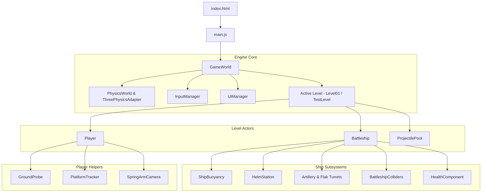

# ScopeCreep Codebase Guide

Welcome to the **ScopeCreep** project! This guide is written to help anyone on the team quickly understand what each file and system does, why it exists, and how everything connects together.

For every component, you'll find:
1. **The Minimum (Why it exists):** A quick 1–2 sentence summary.
2. **How It Works (The details):** Clear, practical explanation of its responsibilities and interactions.

---

## Table of Contents
1. [Core 3D & Physics Terminology](#1-core-3d--physics-terminology)
2. [Entry Point & Canvas](#2-entry-point--canvas)
3. [The Orchestrator (`GameWorld.js`)](#3-the-orchestrator-gameworldjs)
4. [Physics System (`PhysicsWorld.js` & `ThreePhysicsAdapter.js`)](#4-physics-system)
5. [Levels & Environments (`BaseLevel.js`)](#5-levels--environments)
6. [User Interface (`UIManager.js`)](#6-user-interface-uimanagerjs)
7. [Input Handling (`InputManager.js`)](#7-input-handling-inputmanagerjs)
8. [Entities & Base Class (`BaseEntity.js`)](#8-entities--base-class)
9. [Warship (`Battleship.js` & `BattleshipColliders.js`)](#9-warship)
10. [Health Component (`HealthComponent.js`)](#10-health-component)
11. [Ship Stations & Guns (`BaseStation.js`, `HelmStation.js`, etc.)](#11-ship-stations--guns)
12. [Smart Camera (`SpringArmCamera.js`)](#12-smart-camera-springarmcamerajs)
13. [Player & Walking on Moving Decks](#13-player--walking-on-moving-decks)
14. [Projectiles & Object Pooling](#14-projectiles--object-pooling)

---

## 1. Core 3D & Physics Terminology

### Mesh (Visual Model)
- **The Minimum:** The visible 3D shape drawn on the screen.
- **How It Works:** A mesh consists of 3D geometry (vertices, triangles) and materials/textures (colors, shaders, lighting reactions). Meshes are handled by Three.js and rendered by your graphics card. A mesh has **no physical presence** on its own—objects can pass right through it unless paired with a collider.

### Collider (Physical Boundary)
- **The Minimum:** The invisible physical boundary used by the physics engine to detect collisions.
- **How It Works:** While a visual mesh can have thousands of detailed triangles, physics engines (like Rapier 3D) need simplified shapes (cuboids, capsules, convex hulls) to calculate collisions, friction, and bouncing fast at 60+ FPS.

---

## 2. Entry Point & Canvas

### [`index.html`](../index.html)
- **The Minimum:** The HTML webpage that holds the WebGL `<canvas>` and UI overlay container.
- **How It Works:** Contains the root `
`, the `<canvas id="game-canvas">` where Three.js renders 3D graphics, and the `
` where DOM UI elements (menus, prompts, HUD) live.

### [`src/main.js`](../src/main.js)
- **The Minimum:** The JavaScript startup file that initializes the game and loads the Main Menu.
- **How It Works:** Instantiates `GameWorld`, initializes Rapier physics WebAssembly asynchronously, registers available missions in `AVAILABLE_LEVELS`, and displays the initial level selection menu. When you create a new level, you register it here.

---

## 3. The Orchestrator (`GameWorld.js`)

### [`src/core/GameWorld.js`](../src/core/GameWorld.js)
- **The Minimum:** The central engine hub that manages the scene, clock, renderer, camera, and the per-frame game loop.
- **How It Works:**
  `GameWorld` connects all the engine pieces together:
  - Holds `PhysicsWorld`, `InputManager`, `UIManager`, and `currentLevel`.
  - Manages level loading, level restarts, and pausing (`isPaused`).
  - Runs an **8-Phase Game Loop** every frame to prevent visual stutter and character clipping:
    1. **Phase 1 (Input):** Reads current keyboard/mouse states and hotkeys.
    2. **Phase 2 (Pre-Physics):** Moving platforms (like the floating Battleship) update positions and buoyancy *before* the physics step.
    3. **Phase 3 (Physics Step):** Rapier advances time and calculates collisions.
    4. **Phase 4 (Post-Physics):** Walking characters sweep and resolve movement against moving platform surfaces.
    5. **Phase 5 (Gameplay):** Turrets traverse, weapons fire, projectiles advance, and health updates.
    6. **Phase 6 (Late Update):** Follow cameras position themselves after all actors have settled.
    7. **Phase 7 (Render):** WebGL draws the frame to the canvas.
    8. **Phase 8 (Input Flush):** Clears transient input flags (like single-frame clicks).

---

## 4. Physics System

### [`src/core/PhysicsWorld.js`](../src/core/PhysicsWorld.js)
- **The Minimum:** The safety bridge between the game and the Rapier 3D WASM physics engine.
- **How It Works:**
  Entities should **never** import or talk to `@dimforge/rapier3d-compat` directly. `PhysicsWorld` encapsulates Rapier. It provides clean helper methods to create rigid bodies, colliders, character controllers, and ground planes, while managing debug wireframes and resource disposal.

### [`src/core/ThreePhysicsAdapter.js`](../src/core/ThreePhysicsAdapter.js)
- **The Minimum:** Reads Three.js 3D meshes and converts their geometry into formats Rapier can use for colliders.
- **How It Works:**
  Extracts vertex matrices and triangle indices from Three.js models (such as imported GLTF/GLB models or procedural meshes) and turns them into collision descriptors (e.g. Trimesh or Convex Hull).

---

## 5. Levels & Environments

### [`src/levels/BaseLevel.js`](../src/levels/BaseLevel.js)
- **The Minimum:** The base template class that all game levels inherit from.
- **How It Works:**
  Defines the common lifecycle for any stage:
  - `init()`: Asynchronously sets up lighting, environment scenery, ocean, and spawns stage entities.
  - `gameplayUpdate(delta)`: Per-frame level logic (Phase 5).
  - `trackDisposable(resource)`: Tracks created lights, geometries, and materials so they can be freed cleanly.
  - `dispose()`: Automatically cleans up all tracked GPU assets when switching levels.

### Concrete Levels:
- **[`Level01.js`](../src/levels/Level01.js):** The ocean mission. Spawns the Gerstner wave water, the floating Battleship, the player avatar, and dev tools camera.
- **[`TestLevel.js`](../src/levels/TestLevel.js):** Flat ground sandbox. Ideal for testing character movement, turrets, and physics without wave motion.

---

## 6. User Interface (`UIManager.js`)

### [`src/ui/UIManager.js`](../src/ui/UIManager.js)
- **The Minimum:** Central coordinator for all 2D screen UI overlays, HUDs, and menus.
- **How It Works:**
  No game entity or level writes raw HTML or inline CSS. Instead, everything goes through `gameWorld.ui`. `UIManager` coordinates dedicated UI components:
  - **`MainMenu`:** Title screen and mission theater selector.
  - **`PauseMenu` & `PauseButton`:** In-game pause modal with Continue, Restart, and Main Menu actions.
  - **`HealthBar`:** Warship hull durability gauge at top center.
  - **`InteractionPrompt`:** `[E] OPERATE ARTILLERY` prompts when near stations.
  - **`StationHUD` & `Crosshair`:** Fullscreen telemetry and reticles when operating turrets or helm.
  - **`ControlsHelper`:** On-screen controls reference card.
  - All styling is consolidated in [`src/ui/ui.css`](../src/ui/ui.css).

---

## 7. Input Handling (`InputManager.js`)

### [`src/core/InputManager.js`](../src/core/InputManager.js)
- **The Minimum:** Translates raw hardware keystrokes and mouse movements into semantic game actions.
- **How It Works:**
  Instead of hardcoding `if (event.code === 'KeyW')` across your code, `InputManager` maps multiple keys to semantic actions:
  - `forward`: `['KeyW', 'ArrowUp']`
  - `firePrimary`: `['Mouse0', 'KeyF']`
  - `pause`: `['Escape', 'KeyP']`
  Entities simply check `input.isActionDown('forward')` or `input.isActionJustPressed('pause')`. Also manages pointer lock (locking the mouse inside the canvas for FPS/turret aiming).

---

## 8. Entities & Base Class (`BaseEntity.js`)

### [`src/entities/BaseEntity.js`](../src/entities/BaseEntity.js)
- **The Minimum:** The base class for all game actors (Player, Battleship, ProjectilePool, etc.).
- **How It Works:**
  Standardizes lifecycle hooks matching the 8-phase pipeline (`prePhysicsUpdate`, `postPhysicsUpdate`, `gameplayUpdate`, `lateUpdate`), holds the visual `this.mesh`, tracks position/quaternion, and provides clean GPU/collider memory cleanup in `dispose()`.

---

## 9. Warship (`Battleship.js` & `BattleshipColliders.js`)

### [`src/entities/Battleship.js`](../src/entities/Battleship.js)
- **The Minimum:** Assembles the entire warship: hull, buoyancy physics, movement controller, weapons, and stations.
- **How It Works:**
  - Loads the imported 3D vessel model.
  - Mounts child components:
    - **`ShipBuoyancy`:** Samples water heights to compute floatation forces, pitch, and roll.
    - **`ShipController`:** Handles rudder steering and engine thrust.
    - **`MainGun` & `FlakTurret`:** Turrets mounted on forward and aft decks.
    - **`HelmStation`:** Interactive helm console for steering.
  - Updates health HUD via `HealthComponent`.

### [`src/entities/ship-components/BattleshipColliders.js`](../src/entities/ship-components/BattleshipColliders.js)
- **The Minimum:** Builds and synchronizes the physical colliders for the ship hull and moving turrets.
- **How It Works:**
  Uses compound cuboid slabs for walking decks (deep enough so characters never fall through moving hulls) and keeps Rapier colliders in sync with animated turret bases.

---

## 10. Health Component (`HealthComponent.js`)

### [`src/entities/components/HealthComponent.js`](../src/entities/components/HealthComponent.js)
- **The Minimum:** A reusable component that manages current health, max health, and damage.
- **How It Works:**
  Can be attached to any entity that can take damage (currently Battleship, ready for Player and aircraft). Handles damage calculations, healing, death callbacks, and exposes simple health percentages for UI bars.

---

## 11. Ship Stations & Guns

### [`src/entities/ship-components/BaseStation.js`](../src/entities/ship-components/BaseStation.js)
- **The Minimum:** The base class for all interactive consoles and seats on the warship.
- **How It Works:**
  Detects player proximity, displays `[E] OPERATE` prompts, handles mounting/dismounting transitions, shifts camera control, and opens station-specific HUDs.

### Subclasses:
- **[`HelmStation.js`](../src/entities/ship-components/HelmStation.js):** Connects player input to ship rudder and engine throttle. Displays naval telemetry (heading, speed in knots).
- **[`ArtilleryTurret.js`](../src/entities/ship-components/ArtilleryTurret.js):** 406mm heavy twin artillery. Manages traverse yaw, barrel pitch elevation, reload timers, and firing high-explosive shells from `ProjectilePool`.
- **[`FlakTurret.js`](../src/entities/ship-components/FlakTurret.js):** 40mm anti-aircraft autocannon. Rapid traverse, high rate of fire, and tracer round ballistics.

---

## 12. Smart Camera (`SpringArmCamera.js`)

### [`src/entities/components/SpringArmCamera.js`](../src/entities/components/SpringArmCamera.js)
- **The Minimum:** A collision-aware follow camera that prevents the camera from clipping inside walls or floors.
- **How It Works:**
  Inspired by Unreal Engine's spring arm:
  - Casts a physics ray from the target (player or ship helm) to the desired camera distance.
  - If a wall or obstacle is hit, it smoothly pulls the camera forward in front of the obstacle.
  - Supports 1st-person and 3rd-person modes with smoothing and shoulder offsets.

---

## 13. Player & Walking on Moving Decks

### [`src/entities/Player.js`](../src/entities/Player.js)
- **The Minimum:** The human avatar controller, handling walking, sprinting, jumping, looking around, and interacting.
- **How It Works:**
  Uses a Rapier **Kinematic Character Controller** capsule. Runs in Phase 4 (`postPhysicsUpdate`) to sample movement inputs and platform deltas.

### Helper Components:
- **[`GroundProbe.js`](../src/entities/player-components/GroundProbe.js):** Casts downward rays to verify if the player is touching the ground or walking on stairs/slopes.
- **[`PlatformTracker.js`](../src/entities/player-components/PlatformTracker.js):** Solves the moving platform problem. When the ship pitches, rolls, or surges forward across waves, `PlatformTracker` calculates the ship's frame-to-frame delta transform and applies it to the player so they stay firmly standing on the deck without sliding off.

---

## 14. Projectiles & Object Pooling

### [`src/entities/ProjectilePool.js`](../src/entities/ProjectilePool.js)
- **The Minimum:** Pre-allocates and recycles projectile instances to avoid garbage collection stutter during intense combat.
- **How It Works:**
  Constantly creating and destroying 3D objects with `new` and `dispose()` causes browser memory garbage collection hiccups. The pool creates an array of projectiles once on startup. When a turret fires, it fetches an inactive projectile, initializes its velocity and position, and returns it to the inactive pool when it hits a target or expires.

### [`src/entities/projectile-components/Projectile.js`](../src/entities/projectile-components/Projectile.js)
- **The Minimum:** The individual bullet/shell in flight.
- **How It Works:**
  Calculates ballistic trajectory with gravity and drag, performs continuous collision raycasts to detect hits, applies damage to targets via `HealthComponent`, and triggers visual splash/explosion effects.

---

## Summary Diagram

